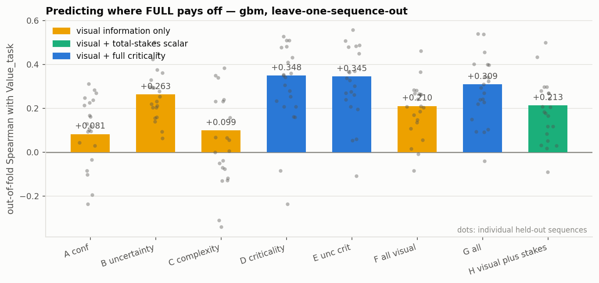
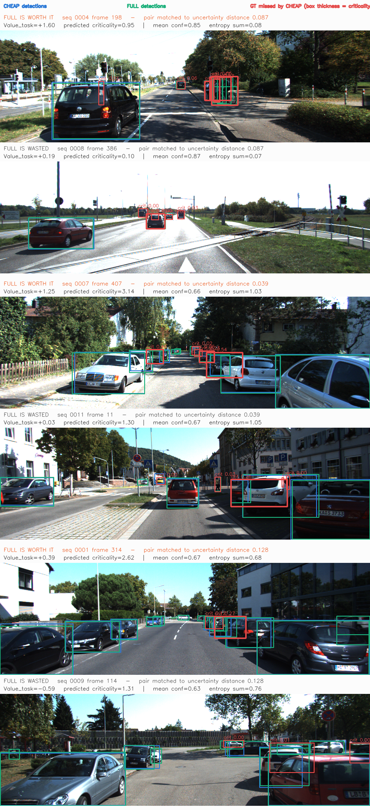
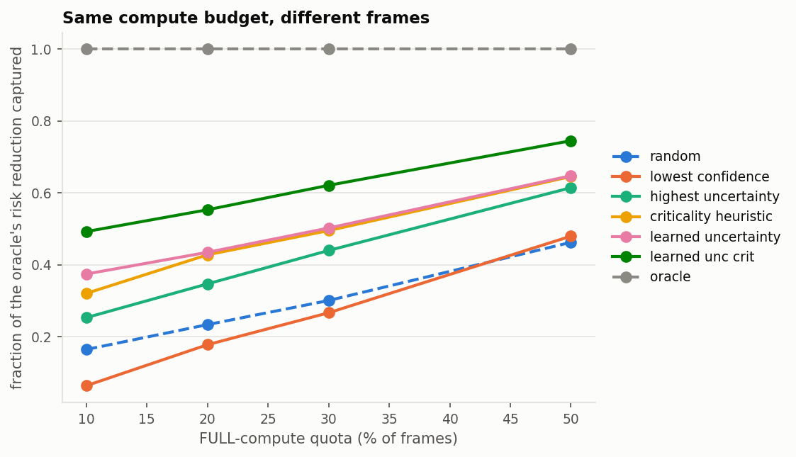
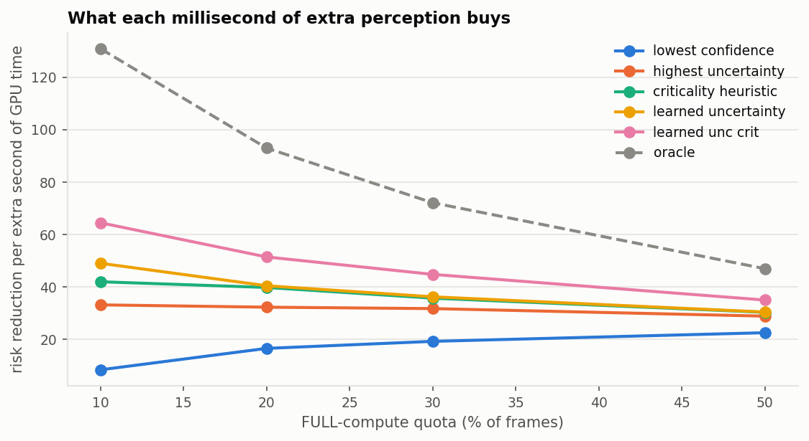

# Phase 0: Does downstream criticality tell you where perception compute is worth spending?

**Verdict: GO — with one finding that reframes the method.** The seven direct answers
are at the end; the short version is that criticality carries information visual
uncertainty does not, but *not* the information we expected it to carry, and the
difference matters for what Phase 1 should build.

Generated from `results/raw/` on a Jetson AGX Xavier. Every run directory stores its
resolved config, git commit and environment, so each number below traces back to the
code that produced it.

> Figure paths below are relative to this file inside the repository. A rendered version
> with the figures inlined is published at
> <https://claude.ai/code/artifact/420ce9d6-e4c7-405a-a7b5-2dc515841b31>.

| | |
|---|---|
| Data | KITTI tracking, 21 labelled sequences, 8 008 frames, 46 469 evaluable GT objects |
| Detector | YOLOv8s, one set of weights, FP16 TensorRT |
| CHEAP | 96 × 320 network input (`cheap_320`) |
| FULL | 192 × 640 network input (`full_640`) |
| Criticality | `composite` — ego-corridor overlap × (proximity, TTC), from GT 3D geometry |
| Perception error | missed detection at IoU ≥ 0.5, class-agnostic |
| Evaluation | leave-one-sequence-out; every predictor number is out-of-fold |
| Profile run | `20260911_140226_profile` |
| Mechanism run | `20260911_143838_mechanism` |
| Analysis run | `20260911_150044_analysis` |

## What is oracle and what is deployable

`Value_task(t) = Risk(t, CHEAP) − Risk(t, FULL)` is an **oracle**. It is built from GT
3D boxes, track-derived range rate and the FULL prediction — none of which a deployed
gate has. It exists to define the target, not to be computed at runtime.

Everything on the predictor side is restricted to what a gate could actually compute:
the CHEAP detections of the current frame, the CHEAP detections and downscaled image of
the *previous* frame, and the camera calibration. Distances, lateral offsets and TTC on
the feature side are estimated monocularly from 2D boxes — a ground-plane cue fused with
a class height prior, and scale-change looming for TTC. `rap.features.assert_no_leakage`
checks every column offered to a model against a provenance registry, and
`tests/test_no_leakage.py` asserts the registry is complete at import so the guard
cannot pass vacuously on a table loaded from disk.

---

## A. Is the value of extra perception compute heterogeneous?

**Yes, strongly.**

| | |
|---|---|
| Frames where FULL helps | 59.8 % |
| Frames where FULL changes nothing at all | **36.4 %** |
| Frames where FULL is actively *worse* | 3.8 % |
| Share of total risk reduction in the top 10 % of frames | **60.2 %** |
| Share in the top 20 % | **85.5 %** |
| Gini of `Value_task` | 0.768 |
| Total risk reduction from running FULL everywhere | 44.7 % (2289.9 → 1265.6) |

Spending FULL compute uniformly is therefore mostly waste: over a third of frames pay
the full price for literally zero risk reduction. This is the precondition for the whole
research programme and it holds comfortably.

`Value_task` and `Value_visual` (the same quantity with every criticality set to 1)
correlate at Spearman 0.752 — related, but far from the same ordering. That gap is what
the rest of the study is about.

---

## B. What does extra compute actually buy — and does it coincide with what matters?

This is the finding that reframes the project, and it was not in the original plan.

Extra resolution recovers **small, distant** objects. Criticality lives on **near,
in-corridor** objects. The two gradients point in opposite directions.

| ego distance | recall CHEAP | recall FULL | share of all criticality | share of risk FULL recovers |
|---|---|---|---|---|
| 0–10 m | 0.805 | 0.849 | 0.394 | 0.090 |
| 10–20 m | 0.621 | 0.780 | 0.335 | 0.325 |
| 20–30 m | 0.421 | 0.698 | 0.164 | 0.295 |
| 30–45 m | 0.298 | 0.649 | 0.077 | 0.190 |
| 45–60 m | 0.041 | 0.584 | 0.021 | 0.082 |
| 60 m + | 0.015 | 0.363 | 0.008 | 0.018 |

Over 46 469 objects: `corr(criticality, recovered by FULL) = −0.188`, and
`corr(distance, recovered) = +0.289`. Objects FULL rescues are *less* critical than
average (mean criticality 0.098 vs 0.164) and further away (33.2 m vs 25.1 m). In the
near field where criticality concentrates, CHEAP already succeeds — FULL adds 4
percentage points of recall inside 10 m.

**So a naive "spend compute where the stakes are highest" policy points at the frames
where extra compute does the least.** The value of compute lives in a middle band —
roughly 10–45 m, in-corridor, closing — where the perception-difficulty gradient and the
task-stakes gradient overlap. Neither signal alone identifies that band. That is the
real content of the research question, and it is a stronger motivation for a learned
method than the hypothesis we started with.

---

## C. How much does visual uncertainty explain?

Out-of-fold Spearman with `Value_task`, leave-one-sequence-out, three model classes:

| arm | features | linear | shallow tree | gradient boosting |
|---|---|---|---|---|
| A confidence | 10 | +0.113 | +0.105 | +0.081 |
| B visual uncertainty | 24 | +0.296 | +0.259 | +0.263 |
| C scene complexity | 22 | +0.153 | +0.032 | +0.099 |
| D criticality only | 19 | +0.328 | +0.369 | +0.348 |
| E uncertainty + criticality | 43 | +0.348 | +0.369 | +0.345 |
| F all visual (A+B+C) | 46 | +0.258 | +0.220 | +0.210 |
| G everything | 65 | +0.307 | +0.357 | +0.309 |

Three things to take from this:

* **Confidence alone is nearly useless** (ρ ≈ 0.08–0.11) and inconsistent — better than
  chance on only 14–16 of 21 held-out sequences. The obvious baseline is a weak one.
* **Visual uncertainty is real but partial.** ρ ≈ 0.26–0.30, positive on **21/21**
  sequences. As a binary question ("will FULL help this frame at all?") it reaches
  AUC 0.652. It is genuine signal and it is not close to the oracle.
* **Scene complexity is close to worthless** on its own: ρ ≈ 0.03–0.15, better than
  chance on only 10–13 of 21 sequences, with per-sequence values as low as −0.35. Object
  counts and image statistics do not tell you where compute pays.

---

## D. How much does criticality add, and is the gain real?

The obvious objection to any criticality result is mechanical: `Value_task = Σ criticality × error`,
so a frame's *total* criticality sets the scale of its value, and criticality features
recover that scale trivially. Three separate controls were run to separate that artefact
from real information.

### Control 1 — a synthetic null where there is no criticality mechanism

`scripts/99_synthetic_pipeline_check.py` replays the whole pipeline on real GT labels
with simulated detections whose recall depends **only** on apparent box size. There is
no mechanism by which criticality governs whether CHEAP fails. On that null, criticality
features still predicted `Value_task` at ρ ≈ 0.31, and the F→G comparison still gained
+0.157 (p = 0.012). **The naive predictability delta is not, by itself, evidence.** The
matched-pair test on the same null correctly returned ρ = −0.004 (p = 0.82).

### Control 2 — stakes scalar vs criticality structure

Arm H is all visual features plus one number: `feat_crit_sum`, the total predicted
criticality in the frame. That is the pure "stakes" confound, isolated.

| comparison | linear | tree | gbm |
|---|---|---|---|
| F all-visual → **H** (+ stakes scalar) | +0.013 (p = 0.079) | +0.000 (p = 0.418) | +0.003 (**p = 0.554**) |
| **H** → G (+ criticality structure) | +0.089 (p = 0.0036) | +0.128 (p = 0.0016) | +0.123 (**p = 0.0021**) |

Adding the stakes scalar to everything visual **does nothing**, in all three model
classes. Adding the rest of the criticality structure — corridor overlap, per-object
distance, TTC, risk-weighted uncertainty — adds substantially, on 17–18 of 21 held-out
sequences. **The gain is not the scale artefact.**

### Control 3 — specificity: does it help risk, or help detection generally?

Same arms, same folds, target swapped to `Value_visual` (identical error function, all
criticalities set to 1). A feature set that merely senses "busy scene" should help both.

| comparison (gbm) | Δ on `Value_task` | Δ on `Value_visual` | specificity |
|---|---|---|---|
| B → E | +0.085 (p = 0.038) | −0.028 (p = 0.85) | +0.114 |
| F → G | +0.079 (p = 0.0051) | −0.028 (p = 0.94) | +0.108 |
| H → G | +0.123 (p = 0.0021) | −0.017 (p = 0.90) | +0.140 |

Every criticality gain is positive for risk and **negative** for plain detection value.
The information is about downstream consequence, not about detectability.

### The core test — uncertainty-matched pairs

Hold visual uncertainty fixed by matching frames from *different* sequences that look
equally uncertain to the cheap model (nearest neighbours in an 8-component PCA subspace
of the matching variables, caliper on per-dimension RMS distance), then ask whether
criticality still orders the value gap.

| matched on | n pairs | ρ(Δcrit, Δvalue) | p | same test with a scene-scale control (`n_det`) |
|---|---|---|---|---|
| uncertainty | 16 541 | **+0.086** | 2e-28 | +0.052 (p = 3e-11) |
| uncertainty **and** complexity | 6 305 | **+0.099** | 3e-15 | +0.023 (**p = 0.064, n.s.**) |
| uncertainty, tight caliper | 7 282 | +0.027 | 0.020 | −0.008 (p = 0.48) |
| *synthetic null (no mechanism)* | 2 709 | *−0.027* | *0.17* | — |

The pattern is the one that matters: when the match controls both uncertainty **and**
scene complexity, the criticality effect survives at ρ = +0.099 while the scene-scale
control collapses to non-significance. The effect is modest in size but it is specific,
it is highly significant on 6 305 cross-sequence pairs, and the same test returns null
on a dataset built to contain no such effect.

The top pair is the claim in one picture: mean confidence 0.85 vs 0.87 and entropy sum
0.08 vs 0.07 — indistinguishable to any uncertainty gate — but `Value_task` +1.60 vs
+0.19, because one frame's missed objects are pedestrians in the ego corridor and the
other's are parked cars off to the side.

Honesty requires the counter-examples too: `fig7b_exemplar_counterexamples.png` shows
closely matched pairs where criticality points the wrong way. They exist, and at ρ ≈ 0.1
they are common. This is a real but weak per-frame signal whose value shows up in
aggregate allocation, not in individual confident calls.

---

## E. At a matched compute budget, how much does risk-aware routing win?

Every policy is scored identically: rank all frames, spend the FULL budget on the top of
the ranking. Learned scores are out-of-fold. `η` is the share of the oracle's achievable
risk reduction that the policy captures.

| policy | 10 % | 20 % | 30 % | 50 % |
|---|---|---|---|---|
| random | 0.165 | 0.234 | 0.301 | 0.463 |
| lowest confidence | 0.064 | 0.178 | 0.267 | 0.480 |
| highest uncertainty | 0.253 | 0.347 | 0.440 | 0.614 |
| scene complexity | 0.260 | 0.363 | 0.437 | 0.597 |
| criticality heuristic | 0.321 | 0.428 | 0.495 | 0.646 |
| learned, uncertainty | 0.375 | 0.435 | 0.502 | 0.648 |
| learned, all visual | 0.354 | 0.449 | 0.499 | 0.654 |
| **learned, uncertainty + criticality** | **0.493** | **0.553** | **0.621** | **0.745** |
| learned, everything | 0.451 | 0.537 | 0.606 | 0.728 |
| oracle | 1.000 | 1.000 | 1.000 | 1.000 |

At a 20 % quota, adding criticality takes η from 0.435 to 0.553 — a 27 % relative
improvement at *identical* compute. It wins at every quota, and by the most at the
tightest one (10 %: 0.375 → 0.493), which is the regime that matters on an edge device.

### The result that makes this task-specific rather than just better

Score the **same selections** on the standard detection metric instead of risk:

| policy | 10 % | 20 % | 30 % | 50 % |
|---|---|---|---|---|
| **learned, uncertainty** | **0.198** | **0.338** | **0.458** | **0.656** |
| learned, uncertainty + criticality | 0.154 | 0.280 | 0.396 | 0.606 |
| highest uncertainty | 0.143 | 0.303 | 0.421 | 0.614 |

**The ranking reverses.** Uncertainty routing is the better policy if you care about
mAP-style detection error; criticality routing is the better policy if you care about
downstream risk. They are not competing answers to one question — they answer different
questions, and the literature has only been asking the first one. This is the strongest
single piece of evidence that the research question is well posed.

---

## F. Does it survive held-out sequences?

`η` was recomputed per held-out sequence at a 20 % quota, and compared pairwise.

| baseline → candidate | sequences improved | median Δη | Wilcoxon p |
|---|---|---|---|
| learned uncertainty → learned uncertainty + criticality | **19 / 21** | +0.136 | 8.1e-05 |
| highest uncertainty → criticality heuristic | 17 / 21 | +0.074 | 2.6e-04 |
| learned all-visual → learned everything | **20 / 21** | +0.115 | 9.5e-07 |

This is not carried by one or two favourable scenes.

---

## G. Jetson latency, memory and energy

PyTorch eager on this board has a **~19 ms per-layer launch-overhead floor** that is
completely independent of input size — 42× more pixels cost nothing until 1.3 Mpx. A
latency study in eager mode would have measured Python, not perception. Everything below
runs on FP16 TensorRT engines, which is the honest deployment path for Xavier anyway.
Round 0 of each sweep is discarded as warm-up; medians are over rounds 1–3, 400 reps
each, on real KITTI frames, with the board otherwise idle.

| mode | input | GPU inference | end-to-end median | p95 | engine device mem | GPU energy / frame |
|---|---|---|---|---|---|---|
| cheap_320 | 30.7 kpx | 3.15 ms | 10.14 ms | 12.50 ms | 6.1 MB | 24.5 mJ |
| cheap_384 | 49.2 kpx | 5.27 ms | 12.33 ms | 14.70 ms | 7.0 MB | 23.9 mJ |
| cheap_512 | 81.9 kpx | 6.78 ms | 14.57 ms | 16.84 ms | 7.7 MB | 33.3 mJ |
| **full_640** | 122.9 kpx | **7.95 ms** | **16.02 ms** | 18.36 ms | 11.9 MB | 39.0 mJ |
| full_960 | 276.5 kpx | 11.32 ms | 20.06 ms | 21.99 ms | 27.4 MB | 96.3 mJ |

CHEAP → FULL costs **+5.9 ms per frame (1.58×)**, with GPU inference itself **2.5×**
(3.15 → 7.95 ms) and GPU energy **+60 %**. The ~6 ms post-processing is a Python/torch
NMS artefact, near-identical in both modes, so it inflates both end-to-end figures
equally and cancels out of the marginal cost of a routing decision.

**Risk reduction per extra second of GPU time** (the metric that decides whether routing
is worth implementing at all):

| policy | 10 % | 20 % | 30 % | 50 % |
|---|---|---|---|---|
| random | 21.6 | 21.7 | 21.7 | 21.7 |
| highest uncertainty | 33.2 | 32.3 | 31.7 | 28.9 |
| learned, uncertainty | 49.0 | 40.4 | 36.2 | 30.4 |
| **learned, uncertainty + criticality** | **64.5** | **51.5** | **44.8** | **35.0** |
| oracle | 130.9 | 93.0 | 72.1 | 47.0 |

At a 20 % quota the mean frame cost is 11.32 ms (vs 10.14 CHEAP-only and 16.02
FULL-everywhere) and mean GPU energy 27.3 mJ; criticality-aware routing buys 27 % more
risk reduction per millisecond than uncertainty routing, and 59 % more than the best
unlearned uncertainty heuristic.

---

## Sensitivity: does any of this depend on how "risk" was defined?

Every headline comparison was re-run under 25 configurations: 12 criticality
definitions, 3 IoU thresholds, 3 operating confidences, 3 false-positive weights, 2
error forms and class-aware vs class-agnostic matching. Run
`20260911_155416_sensitivity`.

**23 of 23 non-control configurations** show uncertainty + criticality beating
uncertainty alone at a 20 % quota. Median Δη = **+0.118**, minimum **+0.063**. The
F → G predictability gain is significant (p < 0.05) in 22 of those 23.

Two of the twelve criticality models are **negative controls by construction**, and both
behave exactly as they must:

| criticality model | what it means | Δη at 20 % | F → G p |
|---|---|---|---|
| `uniform` | criticality ≡ 1, so `Value_task` collapses to `Value_visual` | **+0.002** | 0.977 |
| `proximity` | criticality is a pure function of distance | **−0.018** | 0.742 |
| `corridor` | ego-path overlap only | +0.121 | 0.027 |
| `ttc` | time-to-collision only | +0.106 | 0.057 |
| `binary` | in-corridor **and** (near or TTC < 4 s) | +0.201 | 0.002 |
| `composite` (primary) | corridor × (proximity, TTC) | +0.118 | 0.005 |

This is more than robustness — it is mechanism. The gain appears **exactly when
criticality depends on ego-path geometry or time-to-collision**, and vanishes when
criticality is constant or reducible to distance. That is the expected pattern if the
extra information is genuinely about the ego vehicle's relationship to the scene: apparent
object size already encodes distance, and visual uncertainty already encodes apparent
size, so a distance-only notion of "criticality" is not new information. Corridor
occupancy and closing time are not recoverable from how confident a detector is.

Two further observations from the sweep. The gain is *largest* under the criticality
definitions that are most selective (`binary` +0.201, `composite_narrow` +0.169) — when
few objects matter, knowing which ones matters most. And it grows with the operating
threshold (0.15 → +0.065, 0.25 → +0.118, 0.40 → +0.144), i.e. it is largest for a
conservative detector that emits few boxes, which is the realistic edge configuration.

---

## Threats to validity

Stated plainly, because they determine how much the above is worth.

1. **Criticality is a modelling choice, not a measurement.** `composite` is one
   parameterisation. The sensitivity sweep re-ran every headline comparison under 25
   configurations and the conclusion held in 23 of 23 non-control cases — but all 12
   criticality models are variations on "close, in front, closing", and a genuinely
   different notion of downstream cost (planner-in-the-loop, say) is untested.
2. **Per-frame signal is weak.** ρ ≈ 0.1 on matched pairs. The budget win is real and
   consistent, but nobody should claim criticality confidently predicts individual
   frames.
3. **KITTI only, and daytime only.** 21 sequences from one city, one camera, one sensor
   rig, good weather. Generalisation to night, rain, or a different mounting geometry is
   untested.
4. **Monocular geometry is crude.** Ground-plane + height-prior range estimation on a
   flat-road assumption. It is what a deployed gate could afford, so its error is part of
   the honest result — but it caps how much of the oracle is reachable.
5. **CHEAP is quite degraded** (47.5 % recall vs 71.7 %). A less aggressive pair
   (cheap_384 → full_640) narrows the compute gap; the mode-selection run
   (`20260911_140836_modesel`) has the numbers for every pair, and the chosen one has
   both the largest heterogeneity and a clear compute gap.
6. **Single detector family.** All of this is YOLOv8s at two resolutions. Whether the
   distance/criticality tension holds for a different architecture is untested.

---

## The seven answers

**A. Is there heterogeneous value-of-compute?**
Yes, decisively. 36.4 % of frames gain *exactly nothing* from FULL, while the top 10 %
of frames carry 60.2 % of the total risk reduction and the top 20 % carry 85.5 %
(Gini 0.768). Running FULL everywhere cuts risk 44.7 %; almost all of that is
purchasable with a fraction of the compute if you know which frames to buy.

**B. How much does visual uncertainty explain?**
A real but clearly incomplete amount. Out-of-fold Spearman with `Value_task` is
0.26–0.30 for the uncertainty arm (AUC 0.652 for the binary "will FULL help?" question),
positive on 21/21 held-out sequences. Confidence *alone* is weak and unreliable
(ρ ≈ 0.08–0.11, better than chance on 14–16/21). Scene complexity is close to useless
(ρ ≈ 0.03–0.15, better than chance on 10–13/21, per-sequence values down to −0.35). So
the answer to the literature's implicit assumption — that detector confidence tells you
where to spend — is no.

**C. How much predictive information does criticality add?**
Beyond *all* visual features: Δρ = +0.079 (17/21 sequences, p = 0.005, gbm), and
+0.123 (p = 0.002) beyond visual features plus a total-stakes scalar. Three controls
say this is not the mechanical scale artefact: adding the stakes scalar alone changes
nothing (p = 0.55); the gain is specific to risk and *negative* for plain detection value
(specificity +0.108 to +0.140); and on uncertainty-and-complexity-matched cross-sequence
pairs criticality still orders the value gap (ρ = +0.099, p = 3e-15) where a scene-scale
control does not (p = 0.064). A synthetic dataset built to contain no such mechanism
returns null on the same test.

**D. How much does risk-aware routing beat uncertainty routing at the same budget?**
At a 20 % FULL quota, η rises from 0.435 to 0.553 — **+27 % relative** at identical
compute — and the advantage is largest at the tightest budget (10 %: 0.375 → 0.493).
In compute terms, 51.5 vs 40.4 risk units per extra second of GPU time. The decisive
detail: scored on the *standard detection metric* the ranking **reverses**, with
uncertainty routing ahead (0.338 vs 0.280). The two objectives want different frames.

**E. Does the effect survive held-out sequences?**
Yes. Criticality-aware selection beats uncertainty selection on **19 of 21** held-out
sequences (median Δη +0.136, p = 8.1e-05); all-features beats all-visual on **20 of 21**
(p = 9.5e-07). Across the sensitivity sweep, 23 of 23 non-control configurations show
the gain, minimum Δη +0.063.

**F. What is the Jetson latency/power trade-off?**
CHEAP 10.14 ms / FULL 16.02 ms end-to-end (p95 12.50 / 18.36), GPU inference 3.15 vs
7.95 ms (2.5×), engine memory 6.1 vs 11.9 MB, GPU energy 24.5 vs 39.0 mJ per frame
(+60 %). A 20 % quota costs 11.32 ms and 27.3 mJ mean per frame. One methodological
result worth keeping: PyTorch eager on Xavier has a ~19 ms launch-overhead floor that is
*completely independent of input resolution*, so this experiment is not measurable at all
without TensorRT.

**G. GO or NO-GO for CVPR 2027?**

**GO.** All six criteria are met:

| # | criterion | result |
|---|---|---|
| 1 | meaningful Jetson compute gap | ✅ 1.58× end-to-end, 2.5× GPU inference, +60 % energy |
| 2 | FULL helps on a subset, is useless elsewhere | ✅ 36.4 % zero-value frames; top 20 % carry 85.5 % |
| 3 | uncertainty does not explain `Value_task` | ✅ ρ ≈ 0.26–0.30 against an oracle of 1.0 |
| 4 | criticality improves held-out prediction | ✅ +0.079 over all-visual, 17/21 seqs, p = 0.005 |
| 5 | risk-aware wins at matched compute, consistently | ✅ +0.118 η at 20 %, 19/21 seqs, p = 8e-05 |
| 6 | gain survives sequences and risk thresholds | ✅ 23/23 non-control configs, min +0.063 |

Neither NO-GO condition fires: confidence/uncertainty captures well under half of the
achievable allocation, and criticality-aware selection wins at every compute quota tested.

---

## What Phase 0 changes about the Phase 1 plan

The original hypothesis was "spend compute where the stakes are high". **That hypothesis
is wrong, and the data says so clearly**: `corr(criticality, object recovered by FULL)
= −0.188`. Objects that extra resolution rescues are *far* (33.2 m vs 25.1 m mean) and
therefore *low*-criticality; in the near field where criticality concentrates, CHEAP
already succeeds.

What is actually true is multiplicative: a frame deserves compute when criticality is
present **and** cheap perception is likely to fail on it — roughly the 10–45 m,
in-corridor, closing band where the two gradients overlap. That explains every result
above, including why the stakes scalar alone is worthless (p = 0.55) while criticality
*structure* is not (p = 0.002), and why the criticality-only arm nevertheless scores
well on its own (it is a good proxy for the product, not for either factor).

So Phase 1 should not be "a risk-weighted uncertainty gate". The proposal:

1. **Factorise the gate explicitly.** Predict `P(cheap perception fails on object i)` and
   `criticality(i)` separately from cheap output, and score a frame by their product
   summed over predicted objects, rather than learning `Value_task` end-to-end. Phase 0
   evidence: the product structure is visible in the data, and the end-to-end learned
   arm (G, ρ 0.309) does not beat the criticality arm (D, ρ 0.348) — a monolithic
   regressor is not exploiting the structure.
2. **Target the overlap band directly.** The failure-probability head should be
   conditioned on apparent size/distance, which is where the CHEAP→FULL recall gap lives
   (recall 0.80 → 0.85 inside 10 m, but 0.04 → 0.58 at 45–60 m).
3. **Close the oracle gap.** The best deployable policy captures 55 % of the oracle at a
   20 % quota. The remaining 45 % is the headroom a method paper has to argue for.
4. **Keep the two-objective evaluation.** The risk/detection reversal is the clearest
   evidence the problem is real; every Phase 1 result should be reported on both.
5. **Only then** consider a learned scheduler. Nothing in Phase 0 justifies RL or a
   neural gate — a gradient-boosted product-of-two-heads on 65 cheap features is the
   right next baseline, and it is what the current evidence supports.

Before any of that, two extensions are cheap and would materially strengthen a
submission: a second dataset (nuScenes or BDD100K, for weather and night), and a second
detector family, to test whether the distance/criticality tension is a property of the
task or of YOLOv8s.
