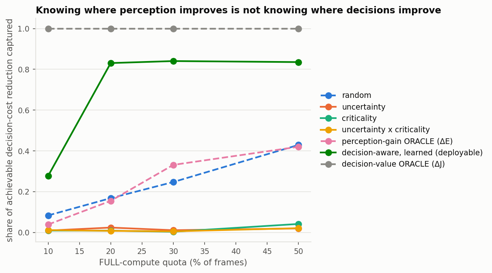

# Phase 0C: Decision-Conditional Marginal Value of Perception Compute

**Verdict: GO on the problem, NO-GO on the method as conceived.** The decision-level
target is real and is genuinely not the perception-level target — but almost all of the
exploitable signal is captured by ego speed and "the cheap model saw nothing", neither of
which is a perception contribution. The ten direct answers are at the end.

| | |
|---|---|
| Data | KITTI tracking, 21 sequences, 8,008 frames, ego speed from oxts |
| Perception | YOLOv8s FP16 TensorRT, `cheap_320` (96×320) vs `full_640` (192×640) |
| Controller | deterministic longitudinal braking, KEEP / DECELERATE / HARD_BRAKE |
| Decision cost | asymmetric: under-braking shortfall², over-braking excess², jerk, collision term |
| Validation | leave-one-sequence-out; all learned scores out-of-fold |
| Runs | `20260911_181039_decision`, `20260911_181639_decision_budget` |

## Experimental setup

`required_decel()` is called with identical code on CHEAP geometry, FULL geometry and
ground-truth geometry; nothing is tuned per mode. The controller sees monocular range and
TTC estimates plus ego speed (a real vehicle reads its own speed off the CAN bus, not off
the camera). Ground truth enters only in the evaluator.

The cost is deliberately **not** `Σ criticality × detection error` — that would be the
Phase-0 metric renamed and the whole exercise would be circular. The controller emits an
action; the action is scored against the true scene by how far the commanded deceleration
falls short of, or exceeds, what the scene actually required.

---

## A. How often does better perception change the decision?

**27.3% of frames.** CHEAP and FULL perception differ on 80.0% of frames, but that
collapses to a 27.3% action-change rate: 17.0% beneficial, **10.3% harmful**.

Action agreement between the two modes:

| CHEAP ↓ / FULL → | DECELERATE | HARD_BRAKE | KEEP |
|---|---|---|---|
| DECELERATE | 764 | 188 | 131 |
| HARD_BRAKE | 264 | 771 | 197 |
| KEEP | 659 | 747 | 4287 |

## B. How often does better perception NOT change the decision?

**67.0% of the frames where detection improved keep exactly the same action.** Two thirds
of measurable perception gain has, by construction, zero decision value.

## C. Does criticality predict decision value?

**No — it is useless here.** Spearman(criticality, ΔJ) = −0.154, and as an allocation
policy criticality captures η = 0.009 at a 20% quota, below random (0.168). This held in
every one of the ten planner and cost variants tested (η between −0.000 and 0.021).

This is a strong negative for the Phase-0 line of work: the criticality signal that
reduced *risk-weighted detection error* does essentially nothing for *decision cost*.

## D. Does perception gain predict decision value?

**No.** Spearman(ΔE, ΔJ) = **+0.041**. A shuffle control that permutes which frames
receive the FULL improvement yields +0.067 — i.e. the measured association is *within the
range of the null*. Perception gain carries essentially no information about decision gain.

## E. Does decision sensitivity add new information?

Yes as a feature group, **no as the proposed mechanism.** Out-of-fold, predicting ΔJ:

| feature group | ρ | AUC(ΔJ>0) | η@20 |
|---|---|---|---|
| visual + criticality | +0.117 | 0.480 *(chance)* | 0.199 |
| decision-sensitivity | +0.282 | 0.811 | **0.831** |
| all cheap-side | +0.310 | 0.795 | 0.721 |

But the ablation dismantles the intended story:

| feature | η@20 |
|---|---|
| ego speed alone | **+0.625** |
| ego speed + required deceleration | **+0.836** |
| decision margin alone | −0.002 |
| boundary distance alone | −0.002 |
| corridor geometry alone | −0.011 |
| all decision-sensitivity **minus ego speed** | **−0.011** |

Remove ego speed and the entire effect vanishes. The decision-margin feature — the
conceptual heart of the hypothesis — is at chance (AUC 0.495).

**The decision-boundary mechanism does not exist in this data.**
Spearman(|required decel − nearest threshold|, |ΔJ|) = **+0.006**, and the binned
relationship is non-monotonic: mean |ΔJ| is 0.83 next to a threshold and 2.23 at a
distance of 1–2 m/s². GO criterion 5 fails outright.

## F. Does a perception-gain oracle leave a gap to a decision-value oracle?

**Yes, an enormous one — this is the strongest result in Phase 0C.**

| policy | η@10 | η@20 | η@30 | η@50 |
|---|---|---|---|---|
| random | 0.084 | 0.168 | 0.247 | 0.429 |
| uncertainty | 0.009 | 0.024 | 0.011 | 0.020 |
| scene complexity | 0.009 | 0.016 | 0.007 | 0.015 |
| criticality | 0.010 | 0.009 | 0.004 | 0.042 |
| uncertainty × criticality | 0.012 | 0.008 | 0.006 | 0.021 |
| **perception-gain ORACLE (ΔE)** | 0.039 | **0.155** | 0.332 | 0.420 |
| visual+criticality (learned) | 0.017 | 0.199 | 0.686 | 0.757 |
| decision-aware (learned, deployable) | 0.277 | **0.831** | 0.841 | 0.836 |
| **decision-value ORACLE (ΔJ)** | 1.000 | 1.000 | 1.000 | 1.000 |

An oracle that knows exactly where FULL improves detection captures **15.5%** of the
achievable decision-cost reduction at a 20% quota — statistically indistinguishable from
random (16.8%). A *deployable* cheap-side decision-aware predictor captures 83.1%, and
beats the perception-gain oracle on 13 of 18 held-out sequences (median Δη +0.253,
p = 0.005).

## G. Can cheap-side features predict decision value on held-out sequences?

Yes, but the honest attribution is uncomfortable:

| heuristic | η@20 |
|---|---|
| ego speed alone | 0.787 |
| "cheap detected nothing" alone | 0.560 |
| confidence, low first *(dominated by the empty-frame case)* | 0.631 |
| confidence excluding empty frames | 0.121 |
| learned decision-sensitivity | 0.831 |
| learned + empty-frame indicator + confidence | 0.837 |

**14.6% of frames have no CHEAP detection at all, and they carry 57.9% of all positive
decision gain.** The dominant decision failure of cheap perception is not subtle
localisation error — it is complete blindness on a minority of frames. Ego speed alone,
which requires no perception model, reaches 0.787 of the 0.831 the full learned model
achieves.

## H. Does decision-aware allocation beat criticality- and uncertainty-aware allocation?

Per-sequence at a 20% quota, Wilcoxon over held-out sequences:

| baseline → decision-aware (learned) | better | median Δη | p |
|---|---|---|---|
| uncertainty | 17/18 | +0.405 | 1.9e−05 |
| uncertainty × criticality | 16/18 | +0.280 | 2.1e−04 |
| criticality | 15/18 | +0.240 | 6.4e−04 |
| perception-gain ORACLE | 13/18 | +0.253 | 0.005 |
| visual+criticality (learned) | 14/18 | +0.208 | 0.013 |

At a 20% quota the decision-aware policy reduces total decision cost from 19,242 to 9,394
(all-FULL would give 9,522 at 100% compute) at a mean cost of 11.3 ms/frame, i.e. 1,060
cost units per extra second of GPU time versus 198 for the perception-gain oracle.

## I. Does the effect survive planner and cost variation?

Yes, across six planner variants and five cost weightings:

| variant | action differs | corr(ΔE,ΔJ) | η ΔE-oracle | η criticality | η decision-aware |
|---|---|---|---|---|---|
| planner default | 0.273 | +0.041 | 0.155 | 0.009 | 0.831 |
| planner insensitive | **0.055** | +0.038 | 0.135 | 0.010 | 0.900 |
| planner aggressive | 0.278 | +0.051 | 0.148 | 0.007 | 0.839 |
| planner wide corridor | 0.274 | +0.070 | 0.147 | −0.000 | 0.662 |
| planner narrow corridor | 0.257 | +0.039 | 0.146 | 0.011 | 0.878 |
| planner no TTC term | 0.136 | +0.126 | 0.169 | 0.004 | 0.935 |
| cost safety-heavy | 0.273 | +0.056 | 0.184 | 0.007 | 0.851 |
| cost comfort-heavy | 0.273 | +0.020 | 0.078 | 0.015 | 0.554 |
| cost no collision term | 0.273 | +0.041 | 0.152 | 0.009 | 0.842 |
| cost symmetric | 0.273 | −0.000 | −0.022 | 0.021 | 0.477 |

`corr(ΔE, ΔJ)` never exceeds +0.126 and the ΔE-oracle never exceeds η = 0.184.
Criticality never exceeds 0.021.

### Negative controls

* **Perception-independent policy.** A fixed action gives `V_dec` identically zero for all
  three actions — the pipeline cannot manufacture decision value.
* **Planner-insensitive control.** Widening the thresholds drops the action-change rate
  from 27.3% to 5.5%, exactly as the plan predicted.
* **Shuffled improvements.** Permuting which frames get the FULL result gives
  corr(ΔE, ΔJ) = +0.067, *above* the real +0.041 — confirming the real association is null
  rather than merely small.

---

## Negative results and threats to validity

1. **The decision-boundary mechanism is false.** ρ(boundary distance, |ΔJ|) = +0.006.
   Value does not concentrate near planner switching points. This was the central
   conceptual claim and it does not survive.
2. **Ego speed does most of the work.** 0.787 of the 0.831. A "decision-aware perception
   gate" whose main input is the speedometer is not a perception contribution.
3. **Monocular range error inflates the effect.** Recomputing with ground-truth range for
   matched detections — isolating *which objects were detected* from *how well they were
   ranged* — drops the action-change rate from 27.3% to 17.2% and harmful changes from
   10.3% to 4.9%. The effect survives (corr(ΔJ_mono, ΔJ_oracle-range) = +0.688) but roughly
   40% of the observed action churn is range-estimation noise, not perception difference.
4. **FULL perception makes decisions worse on 10.3% of frames.** On those frames FULL's
   required deceleration averages 5.46 m/s² against a true 0.86: detecting more distant
   objects, fed through a weak monocular range estimator, produces phantom hard braking.
   More perception is not monotonically better at the decision level.
5. **One planner, one cost family, one dataset, one detector.** The lateral/trajectory
   task in the plan was not implemented; a longitudinal controller alone may over-weight
   range accuracy relative to a full stack.
6. **Only 18 of 21 sequences enter the per-sequence tests** — three have a degenerate
   oracle span at a 20% quota.
7. **The cost is a proxy, not a planner.** No real motion planner, no closed loop: each
   frame is scored open-loop against the true scene, so compounding effects of a bad
   action over time are absent.

## CVPR novelty assessment

What is genuinely new and well-supported:

* Perception gain and decision gain are **empirically uncorrelated** (ρ = 0.041, inside the
  shuffle null), and an oracle on the former captures only 15.5% of the latter's
  achievable reduction. This is a clean, quantified statement that the field's standard
  target is the wrong one for compute allocation.
* Two thirds of detection improvements are **action-invariant**.
* Criticality-weighted risk — the Phase-0 contribution — has **no decision-level value**
  (η ≈ 0.01). That is a negative result about our own prior work and worth reporting.
* Extra perception is **not monotonically beneficial**: 10.3% of frames get worse decisions.

What is not supported:

* The decision-sensitivity mechanism (proximity to a planner decision boundary).
* Any method claim: ego speed plus an empty-frame indicator reaches 0.79–0.84 of the
  learned model, so there is no room yet for a learned perception-side contribution.

## GO / NO-GO

**GO for the problem formulation. NO-GO for the method as conceived.**

| # | criterion | result |
|---|---|---|
| 1 | decisions differ on a meaningful subset | ✅ 27.3% (17.2% with oracle range) |
| 2 | substantial perception gain has no decision value | ✅ 67.0% |
| 3 | ΔJ not explained by criticality | ✅ ρ = −0.154, η = 0.009 |
| 4 | ΔJ not explained by oracle perception gain | ✅ ρ = 0.041, η = 0.155 |
| 5 | ΔJ concentrates near decision boundaries | ❌ ρ = +0.006 |
| 6 | decision features add beyond uncertainty/criticality | ⚠️ yes, but it is ego speed |
| 7 | decision-aware beats the alternatives at matched compute | ✅ 13–17 of 18 sequences |
| 8 | survives held-out sequences and cost sweeps | ✅ 10 variants |

Five of eight met cleanly, one failed, one met only in a way that undercuts the method.

## The one-sentence answer

> **If I already knew exactly where FULL perception improves detector accuracy, would I
> still need to know something about the downstream decision to allocate compute optimally?**
>
> **Yes, decisively** — a perfect perception-gain oracle captures only 15.5% of the
> achievable decision-cost reduction at a 20% compute quota, no better than random — but
> the part of "something about the downstream decision" that is currently exploitable is
> ego speed and whether the cheap model saw anything at all, not any property of the
> perception itself.

## What Phase 1 should be, if anything

The problem result is strong enough to carry a paper; the method result is not. Two
options, in order of my confidence:

1. **A problem/benchmark paper.** "Perception metrics do not predict decision value":
   quantified on a real detector, a real board, with oracles bounding both ends and a
   falsified mechanism. This needs a second downstream task (lateral/avoidance), a second
   dataset, and a closed-loop variant to be convincing — none of which requires a method.
2. **Find a decision-relevant signal that beats ego speed.** The 14.6% blind-frame result
   points somewhere specific: what predicts *complete* cheap-perception failure, as opposed
   to degraded detection? That is a different question from anything Phase 0 or 0B asked,
   and it is where the remaining headroom (0.83 → 1.00) lives.

Do not build a scheduler. The current best deployable policy is "escalate when you are
moving fast or you see nothing", which needs no learning at all.
