# Decision-Conditional Value of Perception Compute

## Complete experimental record, Phase 0 through Phase 0E

**Final verdict: WEAK GO** for a problem-formulation and benchmark paper at CVPR 2027.
**NO-GO** for a method paper. The evidence and the reasoning are below; the project's own
starting hypothesis was falsified twice along the way, and both falsifications are reported
here as prominently as the surviving result.

| | |
|---|---|
| Hardware | Jetson AGX Xavier (L4T R35.6.5, MAXN), FP16 TensorRT throughout |
| Datasets | KITTI tracking — 21 sequences, 8,008 frames, 46,469 objects · nuScenes trainval01 — 85 scenes, 3,376 keyframes |
| Detectors | YOLOv8s (dense head + NMS, 11.2M params) · RT-DETR-l (set prediction, no NMS, 32.1M) |
| Fidelity pairs | YOLOv8 320/384/512→640, 320→960 · RT-DETR 320→640, 480→640 · nuScenes 320→640 |
| Downstream tasks | longitudinal braking · lateral corridor avoidance |
| Code | 3,565 lines library · 3,879 lines scripts · 298 lines tests (21 passing) |
| Provenance | 43 run directories, each with resolved config, git commit and environment |

---

## 1. The arc: what each phase killed

This project changed its mind three times. The sequence matters more than any single
number, because each phase falsified the hypothesis the previous phase had produced.

| phase | hypothesis it tested | outcome |
|---|---|---|
| **0** | Downstream criticality adds allocation signal beyond visual uncertainty | **Confirmed** — but the *mechanism* proposed ("critical scenes deserve compute") was falsified in the same phase |
| **0B** | Value factorises as criticality × P(fail) × P(recover \| fail) | **Killed.** The recoverability factor is inert: median Δη = −0.002, p = 0.73 |
| **0C** | Decision value ΔJ is a distinct target from perception value ΔE | **Confirmed** — and it retired Phase 0's own contribution: criticality-weighted risk has η ≈ 0.01 for decision cost |
| **0D** | The ΔE/ΔJ mismatch survives ego speed, blind frames, geometry, moderate gaps | **Confirmed** on all controls |
| **0E** | It survives a second dataset, a second detector, eight perception metrics, a multi-metric oracle, and temporal evaluation | **Confirmed**, but two falsifiers come close |

The honest summary of the arc: **we found a real phenomenon while being wrong about why it
happens, twice.**

---

## 2. Infrastructure

### 2.1 A methodological result that had to come first

PyTorch eager on Xavier has a **~19 ms per-layer launch-overhead floor that is completely
independent of input resolution**. Measured: 25.5 / 24.9 / 24.9 / 25.5 / 26.9 ms for
320 / 384 / 512 / 640 / 960 while GPU rail power scaled 1.4 → 6.1 W. CUDA-event timing
agreed with wall clock, so this is real GPU-timeline idle — roughly 225 modules at ~85 µs
of launch overhead each. A latency study in eager mode would have measured Python, not
perception.

Everything therefore runs on FP16 TensorRT engines, which is also the honest deployment
path for this board. The engines reproduce eager FP32 to **<0.004 confidence and <0.1 px**
on boxes (YOLOv8) and **0.5 px / 0.002** (RT-DETR), validated against the reference
implementation on real-aspect images.

### 2.2 Leakage discipline

Oracle quantities (ground-truth geometry, the FULL prediction, future frames) are used
freely to *define* targets and never reach a predictor. Both the frame-level and
object-level feature registries are declared statically and checked at import, because the
first version populated them as a side effect of computing features — which made the guard
pass vacuously on any table loaded from disk.

### 2.3 Jetson costs, all main modes

| mode | GPU inference | end-to-end | p95 | engine memory | GPU energy |
|---|---|---|---|---|---|
| cheap_320 | 5.09 ms | 13.16 ms | 16.75 ms | 6.0 MB | 13.9 mJ |
| cheap_384 | 6.10 ms | 14.28 ms | 17.54 ms | 7.0 MB | 19.0 mJ |
| cheap_512 | 7.89 ms | 16.72 ms | 20.27 ms | 7.6 MB | 27.4 mJ |
| full_640 | 9.27 ms | 18.34 ms | 21.90 ms | 11.9 MB | 32.8 mJ |
| ns_cheap_320 | 4.41 ms | 12.80 ms | 15.68 ms | 5.4 MB | 23.7 mJ |
| ns_full_640 | 9.90 ms | 19.36 ms | 22.74 ms | 23.9 MB | 66.5 mJ |
| rt_cheap_320 | 16.80 ms | 25.14 ms | 27.64 ms | 21.4 MB | 327 mJ |
| rt_mid_480 | 21.34 ms | 31.19 ms | 34.29 ms | 35.1 MB | 453 mJ |
| rt_full_640 | 30.95 ms | 43.48 ms | 47.22 ms | 52.8 MB | 700 mJ |

Compute ratios across the paired modes span **1.18×–2.24×** and energy ratios
**1.21×–2.81×**. The allocation decision corresponds to a real hardware trade-off at every
point on that range.

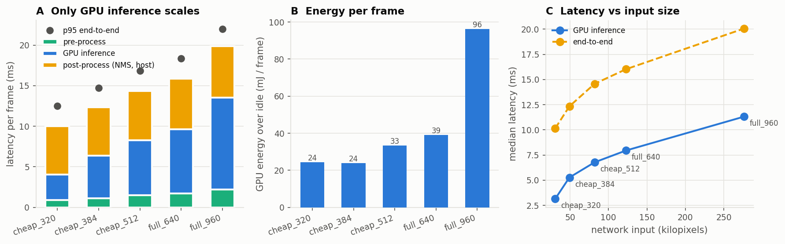

---

## 3. Phase 0 — Is the value of perception compute heterogeneous?

### 3.1 Result: strongly yes

| | |
|---|---|
| Frames where FULL changes nothing at all | **36.4%** |
| Share of total risk reduction in the top 10% of frames | **60.2%** |
| Share in the top 20% | **85.5%** |
| Gini of per-frame value | 0.768 |
| Risk reduction from running FULL everywhere | 44.7% |

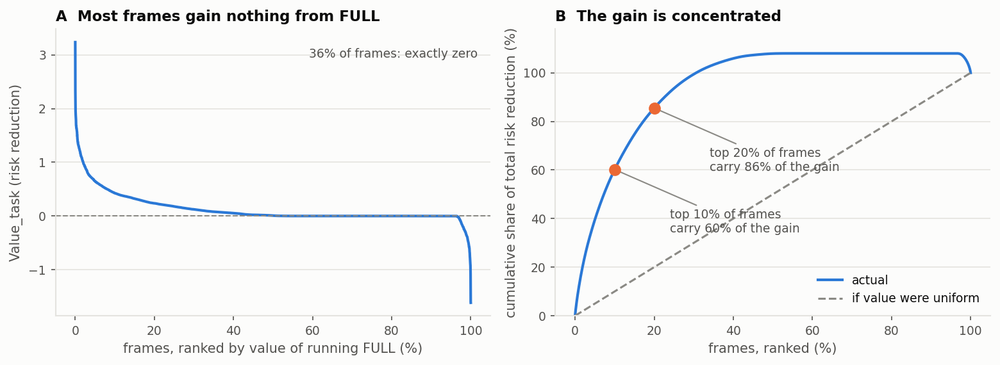

### 3.2 Criticality adds signal — with three controls

Out-of-fold Spearman with risk-weighted value, leave-one-sequence-out, gradient boosting:
confidence alone 0.081, visual uncertainty 0.263, scene complexity 0.099, criticality 0.348.

Three controls separate real information from a scale artefact:

1. **Synthetic null.** The whole pipeline replayed with simulated detections whose recall
   depends only on box size — no criticality mechanism exists — still gave criticality
   ρ ≈ 0.31. *The naive predictability delta is not, by itself, evidence.*
2. **Stakes scalar vs structure.** Adding the single number "total criticality in frame" to
   all visual features does **nothing** (p = 0.554); adding corridor overlap, distance, TTC
   and risk-weighted uncertainty adds +0.123 (p = 0.002).
3. **Matched pairs.** On 6,305 cross-sequence pairs matched on uncertainty *and* complexity,
   criticality still orders the value gap (ρ = +0.099, p = 3e−15) where a scene-scale
   control does not (p = 0.064).

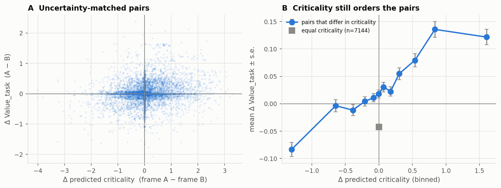

### 3.3 At matched compute

η at a 20% FULL quota: random 0.234, uncertainty 0.435, criticality 0.522,
uncertainty+criticality **0.553** — a 27% relative improvement at identical compute, better
on 19 of 21 held-out sequences (p = 8e−05).

**The result that made it interesting:** scoring the *same selections* on the standard
detection metric reverses the ranking — uncertainty routing wins (0.338 vs 0.280). The two
objectives want different frames.

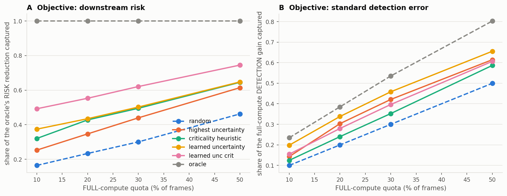

### 3.4 Sensitivity, including two negative controls

25 configurations (12 criticality definitions, 3 IoU thresholds, 3 operating confidences,
3 false-positive weights, 2 error forms, class-aware matching). **23 of 23 non-control
configurations positive**, median Δη +0.118, minimum +0.063. The two built-in negative
controls behave exactly as required: `uniform` criticality gives **+0.002**, `proximity`
(criticality = distance only) gives **−0.018**.

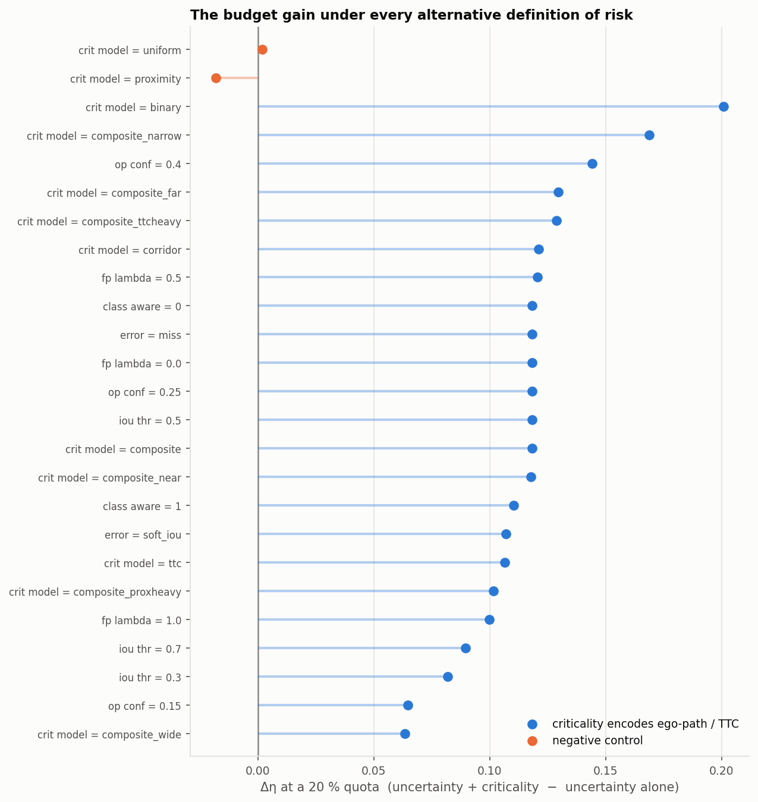

### 3.5 The mechanism was wrong

`corr(criticality, object recovered by FULL) = −0.188`; `corr(distance, recovered) = +0.289`.
Extra resolution recovers **distant** objects (mean 33.2 m vs 25.1 m overall), which are the
**least** critical. Inside 10 m, where 39% of all criticality sits, FULL adds 4 points of
recall; at 45–60 m it adds 54.

**"Spend compute where the stakes are high" is false.** Value lives in an overlap band
(≈10–45 m, in-corridor, closing) that neither signal alone identifies.

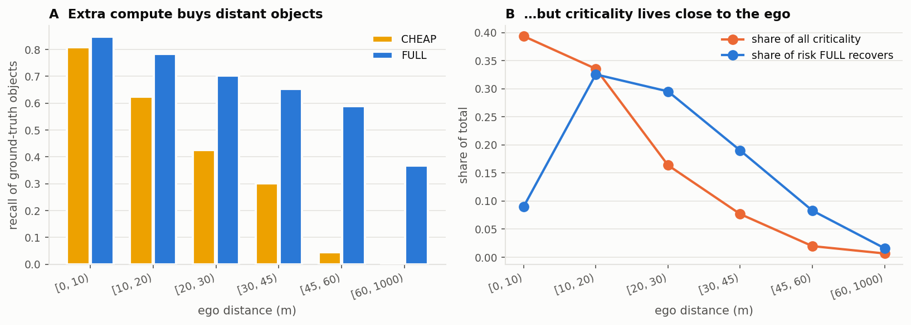

---

## 4. Phase 0B — Does the value factorise into failure × recoverability?

The successor hypothesis was `V ≈ Σ c(i) · P(cheap fails on i) · P(full recovers i | fails)`.

**Failure and recoverability really are different quantities:** P(full recovers | cheap
fails) = **0.49** over all objects, and it is strongly range-dependent — 0.33 inside 10 m
(occlusion and truncation, which resolution does not fix), peaking at 0.79 in 30–60 m, then
falling to 0.50 beyond 60 m.

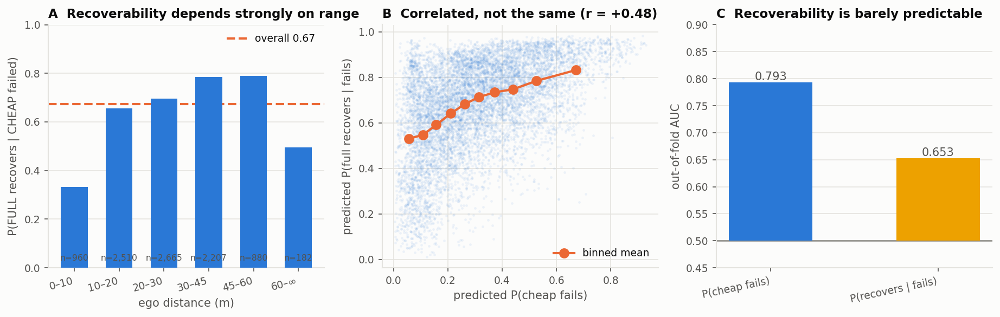

**But the factor is inert.** Out-of-fold AUC is only 0.653 against a base rate of 0.674, and
p_fail and p_recover correlate at r = +0.45, so as a separate multiplicative term it
contributes estimation noise rather than structure:

| comparison (η@20, per-sequence) | better | median Δη | p |
|---|---|---|---|
| fail×crit → fail×**recover**×crit | 8/21 | **−0.002** | **0.73** |
| gain×crit → fail×**recover**×crit | 10/21 | **+0.000** | **0.75** |
| unc×crit (object) → fail×crit | 17/21 | +0.086 | 0.0007 |
| monolithic regressor → gain×crit | 15/21 | +0.066 | 0.005 |
| **criticality alone** → fail×recover×crit | 12/21 | +0.028 | **0.14** |

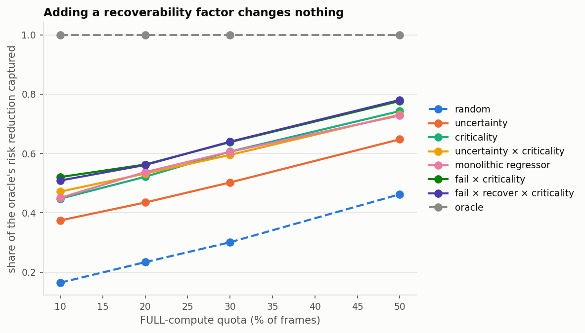

Two conclusions. The three-factor decomposition is **not justified** — a two-factor model is
simpler and equally strong. And the factorised model does **not** significantly beat
criticality alone (p = 0.14), which is a nearly free heuristic.

A structural finding also emerged: only 54.7% of the objects FULL recovers have any CHEAP
candidate to anchor on (66.8% of the recoverable risk mass), so **a third of the opportunity
is invisible to any object-anchored model**, whatever its features.

---

## 5. Phase 0C — Is decision value a different target?

The formulation was replaced rather than patched. A deterministic longitudinal braking
controller (KEEP / DECELERATE / HARD_BRAKE) runs the *identical code* on CHEAP, FULL and
ground-truth geometry; ground truth enters only the evaluator; the cost scores the **action**
against the true scene, never `Σ criticality × detection error`.

| metric | value |
|---|---|
| Frames where perception differs | 80.0% |
| Frames where the **action** differs | **27.3%** |
| Beneficial / harmful action changes | 17.0% / **10.3%** |
| Detection improved but action unchanged | **67.0%** |
| corr(uncertainty, ΔJ) | −0.154 |
| corr(criticality, ΔJ) | −0.154 |
| **corr(ΔE, ΔJ)** | **+0.041** |
| η perception-gain oracle @20 | **0.155** |
| η decision-value oracle @20 | 1.000 |

A shuffle control returns +0.067 — the measured ΔE/ΔJ association lies *inside the null*.

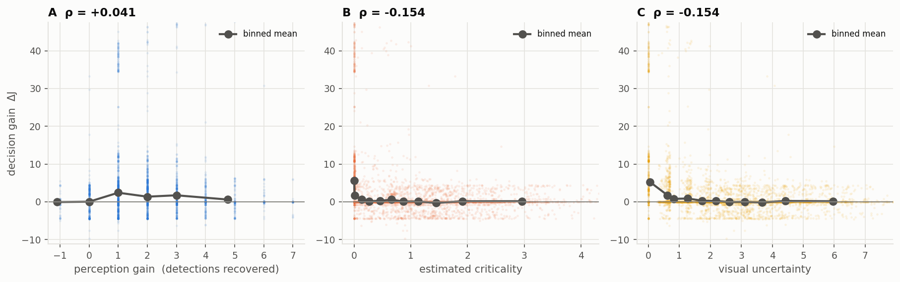
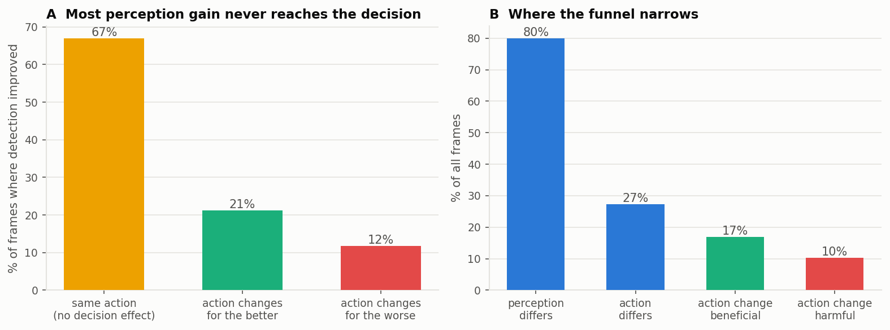

### 5.1 This phase retired Phase 0's contribution

Criticality-weighted risk — the thing Phase 0 established — has **η = 0.009** for decision
cost, *below random* (0.168), and that held in all ten planner and cost variants. Phase 0
measured a better perception metric, not a better allocation objective.

### 5.2 And its own proposed mechanism was also wrong

The hypothesis was that value concentrates near planner decision boundaries.
`ρ(|required decel − nearest threshold|, |ΔJ|) = +0.006`, non-monotonic; decision margin as
a feature is at chance (AUC 0.495). Ablation showed the learned model's 0.831 collapses to
**−0.011** without ego speed, and ego speed alone reaches 0.787.

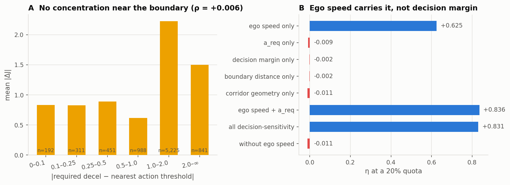

---

## 6. Phase 0D — Does it survive the obvious artefacts?

Pre-registered thresholds, then 13 controls on existing KITTI data.

| control | n | corr(ΔE,ΔJ) | η_E@20 |
|---|---|---|---|
| all KITTI 320→640 | 8,008 | +0.041 | 0.155 |
| speed-stratified budget | 8,008 | +0.041 | 0.213 |
| **non-empty CHEAP only** | 6,839 | **−0.006** | **0.107** |
| **≥2 CHEAP candidates** | 5,618 | **−0.033** | **0.061** |
| oracle range | 8,008 | +0.141 | 0.198 |
| calibrated-noise GT range | 8,008 | +0.056 | 0.141 |
| moderate 512→640 | 8,008 | +0.039 | 0.213 |

Removing the artefacts makes the mismatch **stronger**, not weaker. Partial
Spearman(ΔE, ΔJ | ego speed) = +0.042, unchanged from raw, so speed does not explain the
decoupling; and under a speed-stratified budget the ego-speed heuristic collapses from
0.787 to 0.285.

Phase 0D also added the **lateral avoidance task**, and with it the strongest novelty
signal: top-10% overlap between the two tasks' optimal allocations is **0.032**, with a
shared-cost control returning exactly 1.000.

---

## 7. Phase 0E — Final validation

Eight pre-registered falsifiers, 16 configuration × task rows, 64 Holm-corrected tests.

### 7.1 The core matrix

**`η_perception_oracle@20` never exceeds 0.213 in any of the sixteen rows**, and is negative
in six.

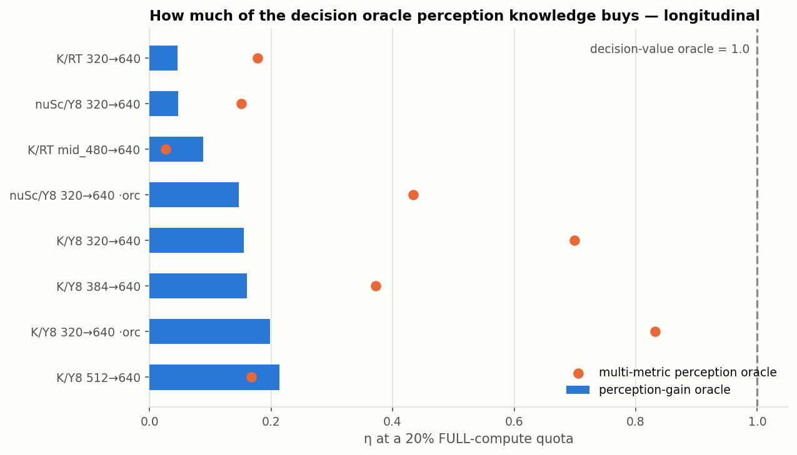

| configuration | task | corr(ΔE,ΔJ) | η percep. oracle | η multi-metric | task overlap | best trivial |
|---|---|---|---|---|---|---|
| KITTI/Y8 320→640 | long | +0.041 | 0.155 | **0.700** | 0.282 | ego speed 0.787 |
| KITTI/Y8 320→640 | lat | −0.034 | −0.257 | −0.268 | 0.282 | uncertainty −0.143 |
| KITTI/Y8 320→640 oracle | long | +0.141 | 0.198 | **0.832** | 0.503 | ego speed **0.864** |
| KITTI/Y8 320→640 oracle | lat | −0.040 | −0.243 | −0.112 | 0.503 | speed+det 0.236 |
| KITTI/Y8 384→640 | long | +0.032 | 0.160 | 0.372 | 0.321 | ego speed 0.508 |
| KITTI/Y8 384→640 | lat | −0.028 | −0.088 | −0.070 | 0.321 | n det 0.014 |
| KITTI/Y8 512→640 | long | +0.039 | 0.213 | 0.167 | 0.388 | ego speed 0.214 |
| KITTI/Y8 512→640 | lat | −0.015 | −0.130 | −0.051 | 0.388 | uncertainty 0.155 |
| KITTI/RT 320→640 | long | +0.003 | **0.046** | 0.178 | 0.229 | speed×empty 0.233 |
| KITTI/RT 320→640 | lat | −0.000 | 0.000 | −0.019 | 0.229 | closest obj 0.355 |
| KITTI/RT 480→640 | long | +0.007 | **0.088** | 0.026 | 0.240 | n det 0.137 |
| KITTI/RT 480→640 | lat | −0.010 | −0.032 | −0.045 | 0.240 | ego speed 0.279 |
| nuScenes/Y8 320→640 | long | +0.001 | **0.047** | 0.151 | 0.686 | speed+det 0.209 |
| nuScenes/Y8 320→640 | lat | −0.027 | −0.073 | 0.111 | 0.686 | n det 0.124 |
| nuScenes/Y8 oracle | long | +0.046 | 0.147 | 0.434 | **0.803** | ego speed 0.242 |
| nuScenes/Y8 oracle | lat | −0.006 | 0.109 | −0.054 | **0.803** | uncertainty 0.445 |

### 7.2 Second detector — the strongest result

RT-DETR-l is a set-prediction transformer with no NMS, 494 modules against YOLOv8s's 225,
operating at ≈3× the detections per frame at the same threshold. It shows the gap **more**
strongly: η_E = 0.046 and 0.088 with correlations of +0.003 and +0.007.

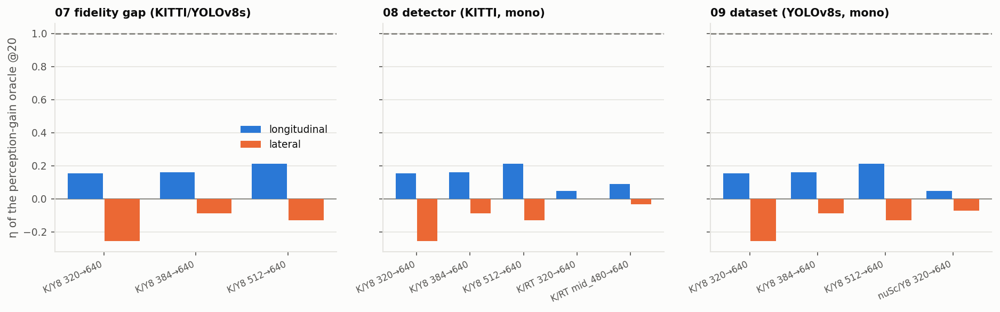

### 7.3 Perception-metric robustness and the multi-metric oracle

Eight per-frame perception losses (FN-only, FN+FP, class-aware, localisation-aware, three
combined weightings, risk-weighted). **The maximum η@20 any single metric reaches anywhere
is 0.274.**

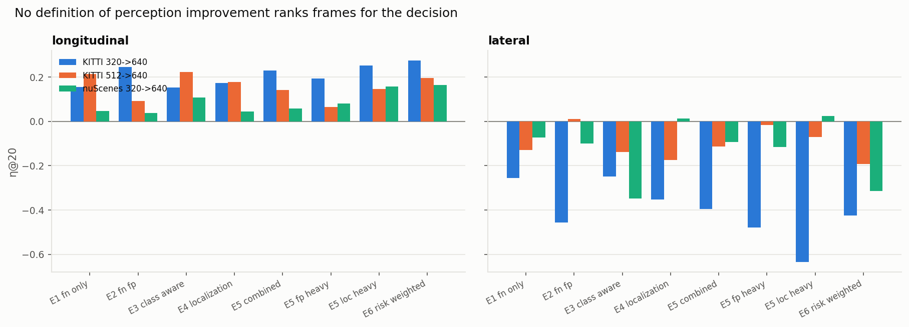

The multi-metric oracle receives ~30 GT-derived features describing *how perception changed*
— every ΔE definition, distance-binned recall improvement, Δdetection count, Δmatched IoU,
Δconfidence mass — and nothing about the decision. It reaches **0.700** on
KITTI/YOLOv8/320→640 longitudinal and **0.832** with exact ranging, but stays ≤ 0.434 in the
other fourteen rows and is negative on four of six lateral rows.

**This is the claim's soft spot and the single most important caveat in the project.**

### 7.4 Temporal replay

A stateful controller with a braking latch, hysteresis, a lateral commitment counter and
history-dependent penalties. *This is replay, not closed loop* — the ego trajectory is
logged, so an action never changes a future observation.

| policy | η long | η lat | collisions | switches |
|---|---|---|---|---|
| random | 0.171 | −0.991 | 32 | 1,579 |
| uncertainty | 0.025 | −0.094 | 34 | 1,408 |
| ego speed | 0.786 | −1.326 | 27 | 1,438 |
| **perception-gain oracle** | **0.162** | −0.383 | 27 | 1,555 |
| decision-value oracle (long) | 1.000 | −1.612 | 25 | **849** |

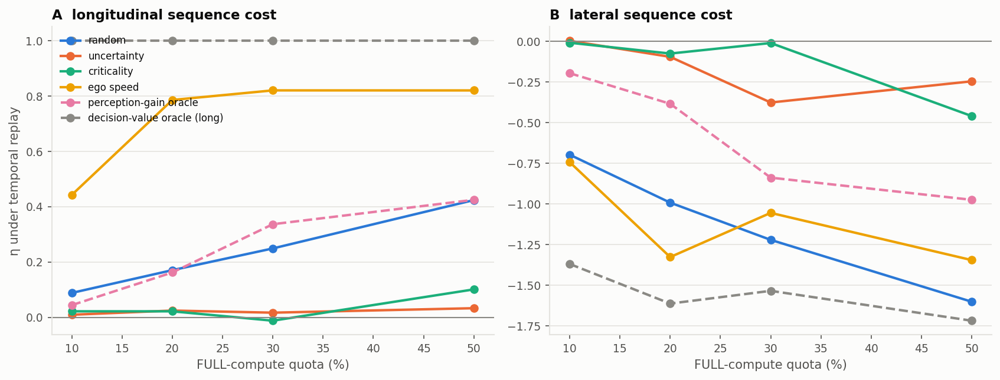

### 7.5 Task conditionality

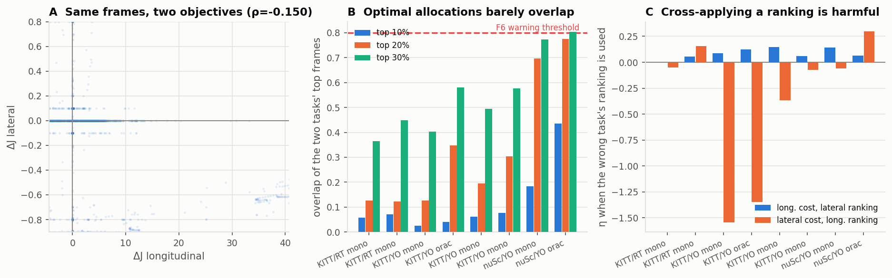

Top-10% overlap 0.03–0.61, top-20% 0.229–0.803. Cross-applying a ranking is actively
harmful: lateral ranking on longitudinal cost gives η = 0.087; the reverse gives
**−1.544** per-frame and **−1.612** under temporal replay.

### 7.6 Trivial-heuristic ceiling

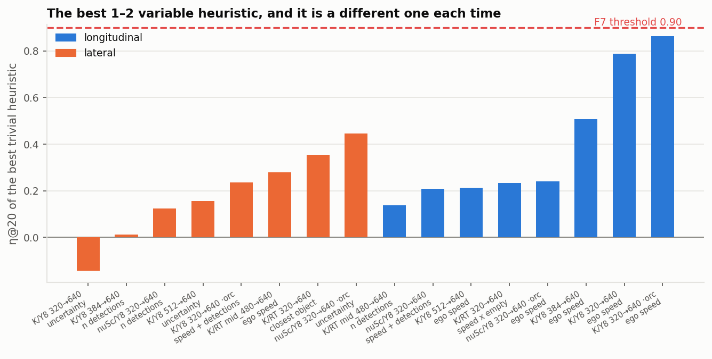

Best trivial heuristic peaks at **0.864**, no row exceeds 0.90 — and **the winner changes in
every row**. Six different heuristics win somewhere (ego speed, uncertainty, detection
count, closest object, speed×empty, speed+detections). There is no single cheap score that
works across configurations, which is task-conditionality restated.

### 7.7 Counterexamples

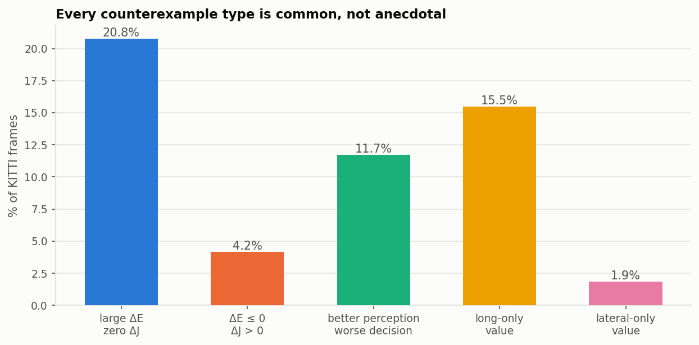

| type | share of KITTI frames |
|---|---|
| A large ΔE, zero ΔJ | 20.8% |
| B ΔE ≤ 0 but decision improves | 4.2% |
| **C perception improves, decision worsens** | **11.7%** |
| D valuable longitudinally, not laterally | 15.5% |
| E valuable laterally, not longitudinally | 1.9% |
| G fast ego but escalation wasted | 19.8% |

On the lateral task, FULL is **worse in aggregate** — cost 2,437 vs 2,170 — despite being
more accurate (83.8% vs 81.9% correct action), in all ten planner and cost variants. It cuts
missed manoeuvres 0.078→0.043 but raises phantom ones 0.071→0.087.

---

## 8. Falsifier ledger

| # | falsifier | threshold | observed | fires? |
|---|---|---|---|---|
| F1 | rich perception oracle closes the gap | η > 0.7 consistently | 0.832 max; > 0.7 in 1/16, ≤ 0.434 in 14/16 | **no, narrowly** |
| F2 | second detector eliminates it | gap vanishes | RT-DETR 0.046 / 0.088 — stronger | no |
| F3 | full-scale nuScenes eliminates it | gap vanishes | 85 scenes: 0.047 | no |
| F4 | moderate fidelity eliminates it | gap vanishes | 1.18× compute: 0.213 | no |
| F5 | temporal evaluation eliminates it | gap vanishes | 0.162 vs 0.155 | no |
| F6 | task rankings converge | overlap > 0.8 consistently | 0.229–0.803; > 0.8 in 2/16 | **no, narrowly** |
| F7 | a trivial heuristic solves it | η > 0.9 across configs | max 0.864; winner differs every row | no |
| F8 | better geometry makes ΔE sufficient | η_E → 1.0 | ≤ 0.198 with oracle range | no |

**60 of 64** sequence-level Wilcoxon tests remain significant after Holm correction. The four
that do not are all in one underpowered cell — nuScenes / oracle range / lateral — where only
5 scenes retain enough lateral decision activity.

---

## 9. Negative controls

All six are executable tests (21 tests pass).

| control | expectation | observed |
|---|---|---|
| A fixed-action policy | ΔJ ≡ 0 | exactly 0 |
| B shuffled FULL improvements | relation vanishes | real \|ρ\| 0.016 inside the null |
| C insensitive planner | fewer changes | 0.273 → 0.055 |
| D shared cost both tasks | overlap → 1 | exactly 1.000 |
| E identical modes | ΔE = ΔJ = 0 | exactly 0, both tasks |
| F task-agnostic score | none wins both | best trivial differs every row |

Control B needed its scope corrected mid-flight: on two short sequences the real
\|ρ(ΔE, ΔJ)\| reaches **0.35**, outside the null, while over eight it is 0.016, inside it.
**The decoupling is a population-level claim**, and the test now asserts it at that scale.

---

## 10. Bugs found and fixed — because they changed conclusions

| bug | effect | how it surfaced |
|---|---|---|
| PyTorch eager latency floor | would have measured Python, not perception | direct CUDA-event diagnosis after flat latency across 5 resolutions |
| `DetCache` held a lazy `NpzFile` | every frame access re-inflated whole arrays; table building 8.6× slower | profiled instead of guessing when a sweep projected to 6 hours |
| Feature registries filled as a side effect | leakage guard passed vacuously on saved tables | guard raised on a table loaded from disk |
| nuScenes box centre convention | translation is the box **centre**, not bottom face; boxes shifted h/2 ≈ 30 px; **0.5%** detections matched GT | oracle-range variant returned numbers *identical* to mono, which is impossible if matching ever succeeds — after fix, 63.4% |
| Decision margin computed against a cost while the controller used thresholds | margin nearly constant (0.73 vs 0.75) | sanity-checking a feature that should vary at a boundary |
| Lateral planner degenerate | GT chose KEEP on 97% of frames | measured the clearance distribution rather than guessing parameters |
| Greek letters under `text-transform: uppercase` | **ρ** rendered as **Ρ** beside an actual p-value column | reading the rendered PDF |

---

## 11. Threats to validity

1. **Replay, not closed loop.** No simulator; actions never change future observations.
2. **Two hand-built rule-based planners.** Cost weights were swept (10 lateral, 5
   longitudinal variants) but remain proxies for a real planning stack.
3. **Monocular geometry is the deployed path.** With oracle range the KITTI per-sequence
   median η_E rises from 0.159 to **0.405**, and on nuScenes from 0.000 to 0.400 with
   **11 of 24** scenes above 0.5. A LiDAR or stereo stack — i.e. most deployed stacks —
   would show a materially smaller gap than the monocular headline.
4. **One nuScenes blob.** 85 of 850 scenes, daytime-dominated; no night/rain stratification.
5. **Detectors are not operating-point-matched.** RT-DETR emits ≈3× the detections.
6. **The lateral harm may be a precision story** rather than a resolution story.
7. **Per-sequence variance is high** in the oracle-geometry configurations.

---

## 12. Recommendation

**Write the benchmark paper; do not build the method.**

What is defensible and well-supported:

- Perception-level metrics — mAP-style and the risk-weighted variants — **do not rank frames
  by downstream decision value**. An oracle on them captures under a quarter of the
  achievable decision-cost reduction in every one of sixteen configurations.
- The optimal allocation is **task-conditional**: two tasks on the same frames agree on
  3–15% of their top-ranked frames, and cross-applying a ranking is worse than doing nothing.
- More perception is **not monotonically better**: 11.7% of frames get a worse decision, and
  an entire downstream task is worse in aggregate.
- The measurement apparatus itself is the contribution: two tasks, two datasets, two
  detectors, five fidelity pairs, eight perception metrics, three geometry sources, six
  negative controls, and both oracles bounding the problem from each end.

What is **not** supported, and should not be claimed:

- Any method. Phase 0C showed the best deployable predictor is essentially ego speed plus an
  empty-frame flag; Phase 0B showed the factorised decomposition adds nothing over its own
  two-factor simplification; neither beats criticality alone significantly.
- That critical scenes deserve more compute (falsified in Phase 0).
- That value concentrates at planner decision boundaries (falsified in Phase 0C).

**One caution for whoever writes it.** The phenomenon is weakest exactly where the setup is
most artificial — KITTI, YOLOv8, the aggressive 320→640 gap, exact ranging — and strongest
in the more realistic configurations. Lead with RT-DETR and the moderate gaps. A reviewer
who probes the flagship KITTI configuration with a multi-metric oracle will find 0.83, and
the paper should get there first.

---

**FINAL VERDICT: WEAK GO** — problem-formulation and benchmark paper, not a method paper.
**READY TO WRITE: YES.**
