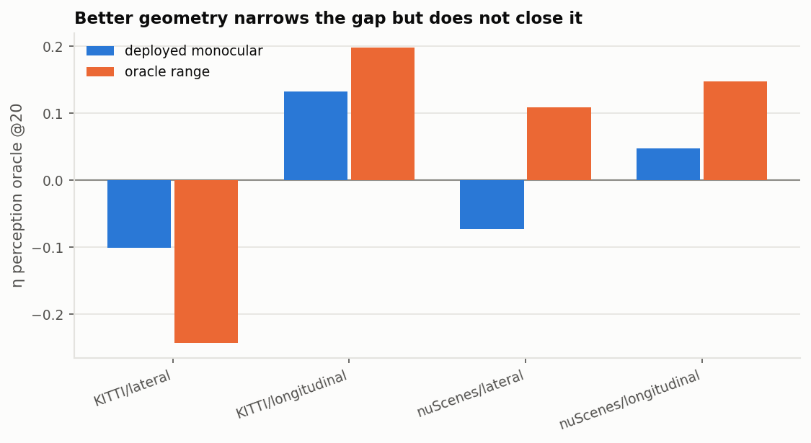
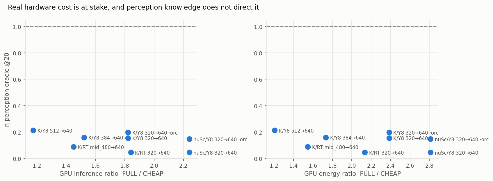

# Phase 0E — Final Experimental Validation

**Verdict: WEAK GO.** The phenomenon is real, generalizes across every dimension tested,
and survives all eight pre-registered falsifiers — but two of them come close enough, in
the single configuration a paper would most naturally headline, that this cannot honestly
be called a STRONG GO. The final answers are in §Direct answers; the verdict statement is
at the very end.

| | |
|---|---|
| Datasets | KITTI tracking (21 seq, 8,008 frames) · nuScenes trainval01 (85 scenes, 3,376 keyframes) |
| Detectors | YOLOv8s (dense head + NMS, 11.2M params) · RT-DETR-l (set prediction, no NMS, 32.1M) |
| Fidelity pairs | YOLOv8 320/384/512→640 · RT-DETR 320→640, 480→640 |
| Tasks | longitudinal braking · lateral corridor avoidance |
| Geometry | deployed monocular · oracle range · calibrated-noise GT |
| Perception losses | 8 definitions, plus a multi-metric oracle over 30 perception features |
| Hardware | Jetson AGX Xavier, FP16 TensorRT throughout |
| Artefacts | `results/final/{core_matrix,headline_table,statistical_tests,run_manifest}.csv`, `results/final/figures/` |

## Research claim

Pre-registered before any Phase 0E result existed:

> Marginal improvement in perception quality is not a reliable proxy for marginal
> improvement in downstream decision quality, and the value of extra perception compute is
> **task-conditional**: `V = V(scene, downstream objective)` rather than a scalar property
> of the frame.

    dE_t     = E(z_c,t) − E(z_f,t)
    dJ_t^(q) = J_q(π_q(z_c,t), s*) − J_q(π_q(z_f,t), s*)

Three properties had to hold separately — **distinct**, **general**, **non-trivial** — and
eight falsifiers were named in advance.

## Experimental matrix

16 rows = 8 configurations × 2 downstream tasks. The single number that decides the claim
is `η_perception_oracle@20`: the share of the achievable decision-cost reduction that an
*oracle on perception gain* captures at a 20% FULL-compute quota.

| configuration | task | corr(ΔE,ΔJ) | η random | **η percep. oracle** | η multi-metric | task overlap | best trivial |
|---|---|---|---|---|---|---|---|
| KITTI/Y8 320→640 mono | long | +0.041 | 0.170 | **0.155** | 0.700 | 0.282 | ego speed 0.787 |
| KITTI/Y8 320→640 mono | lat | −0.034 | −0.430 | **−0.257** | −0.268 | 0.282 | uncertainty −0.143 |
| KITTI/Y8 320→640 oracle | long | +0.141 | 0.195 | **0.198** | **0.832** | 0.503 | ego speed **0.864** |
| KITTI/Y8 320→640 oracle | lat | −0.040 | −0.321 | **−0.243** | −0.112 | 0.503 | speed+det 0.236 |
| KITTI/Y8 384→640 mono | long | +0.032 | 0.085 | **0.160** | 0.372 | 0.321 | ego speed 0.508 |
| KITTI/Y8 384→640 mono | lat | −0.028 | −0.150 | **−0.088** | −0.070 | 0.321 | n det 0.014 |
| KITTI/Y8 512→640 mono | long | +0.039 | 0.058 | **0.213** | 0.167 | 0.388 | ego speed 0.214 |
| KITTI/Y8 512→640 mono | lat | −0.015 | −0.019 | **−0.130** | −0.051 | 0.388 | uncertainty 0.155 |
| KITTI/RT 320→640 mono | long | +0.003 | 0.058 | **0.046** | 0.178 | 0.229 | speed×empty 0.233 |
| KITTI/RT 320→640 mono | lat | −0.000 | −0.026 | **0.000** | −0.019 | 0.229 | closest obj 0.355 |
| KITTI/RT 480→640 mono | long | +0.007 | 0.057 | **0.088** | 0.026 | 0.240 | n det 0.137 |
| KITTI/RT 480→640 mono | lat | −0.010 | +0.028 | **−0.032** | −0.045 | 0.240 | ego speed 0.279 |
| nuScenes/Y8 320→640 mono | long | +0.001 | 0.126 | **0.047** | 0.151 | 0.686 | speed+det 0.209 |
| nuScenes/Y8 320→640 mono | lat | −0.027 | −0.127 | **−0.073** | 0.111 | 0.686 | n det 0.124 |
| nuScenes/Y8 320→640 oracle | long | +0.046 | 0.089 | **0.147** | 0.434 | **0.803** | ego speed 0.242 |
| nuScenes/Y8 320→640 oracle | lat | −0.006 | +0.092 | **0.109** | −0.054 | **0.803** | uncertainty 0.445 |

**`η_perception_oracle@20` never exceeds 0.213 in any of the sixteen rows.** In six of
them it is negative: ranking frames by perception gain is *worse than not allocating at all*.

## Dataset scale

nuScenes trainval01, 85 scenes / 3,376 CAM_FRONT keyframes, scene-level splits throughout.
Ego speed mean 6.1 m/s (KITTI 6.6); monocular relative range error σ = 0.372 (KITTI 0.352);
20.6% of frames have no CHEAP detection (KITTI 14.6%). Engines were rebuilt at 16:9 to
preserve the KITTI pair's 4× pixel ratio, so the fidelity gap is comparable across datasets.

**F3 does not fire.** At 85 scenes the gap is *stronger* than at mini scale: η_E = 0.047
longitudinal (mini: 0.058), −0.073 lateral (mini: −0.181), corr(ΔE,ΔJ) = +0.001.

## Detector generalization

Detector-B is **RT-DETR-l**: a set-prediction transformer with no NMS, 494 modules and
32.1M parameters against YOLOv8s's 225 and 11.2M — architecturally independent, not a YOLO
variant. Chosen over EfficientDet/YOLOX because it exported cleanly to TensorRT 8.5 and is
the most different from the incumbent. Its TRT engine reproduces eager output to 0.5 px and
0.002 confidence. It operates at a very different point: 14.9/19.8 detections per frame at
the 0.25 threshold, against YOLOv8's 3.6/6.1.

**F2 does not fire, decisively.** RT-DETR shows the gap *more* strongly than YOLOv8:
η_E = 0.046 (aggressive) and 0.088 (moderate) longitudinal, 0.000 and −0.032 lateral, with
corr(ΔE,ΔJ) of +0.003 and +0.007 — indistinguishable from zero.

## Fidelity-gap robustness

| pair | GPU compute ratio | GPU energy ratio | action change | η_E long |
|---|---|---|---|---|
| YOLOv8 320→640 | 1.82× | 2.38× | 0.273 | 0.155 |
| YOLOv8 384→640 | 1.52× | 1.73× | 0.226 | 0.160 |
| YOLOv8 512→640 | **1.18×** | **1.21×** | 0.191 | **0.213** |
| RT-DETR 320→640 | 1.84× | 2.13× | 0.302 | 0.046 |
| RT-DETR 480→640 | **1.45×** | **1.55×** | 0.249 | **0.088** |
| nuScenes YOLOv8 320→640 | 2.24× | 2.81× | 0.089 | 0.047 |

**F4 does not fire.** At the most moderate gap tested — 1.18× GPU compute, where CHEAP is
already close to FULL — the perception oracle still captures only 0.213.

## Perception-metric robustness

Eight frame-level perception losses: FN-only, FN+FP, class-aware, localization-aware, three
weightings of a combined loss, and the Phase-0 risk-weighted error (kept only for
comparison). Dataset-level AP is deliberately absent — it is not defined per frame.

Across all 8 metrics × 3 configurations × 2 tasks, the **maximum** η@20 any single metric
reaches anywhere is **0.274** (risk-weighted error, KITTI 320→640 longitudinal). On the
lateral task almost every metric is negative, bottoming at −0.634. No definition of
"perception improved" ranks frames usefully for the decision.

## Multi-metric perception oracle

The reviewer attack this anticipates is "you picked the wrong metric". A diagnostic oracle
is given ~30 features describing *how perception changed* — all eight ΔE definitions,
distance-binned recall improvement, Δdetection count, Δmean matched IoU, Δconfidence mass,
and the raw per-mode FN/FP/localization primitives — and **nothing** about the decision, the
action, or any planner variable. Fitted leave-one-sequence-out with linear and gradient
boosting.

| configuration | task | best single metric | linear | **GBM** |
|---|---|---|---|---|
| KITTI 320→640 | longitudinal | 0.274 | 0.634 | **0.700** |
| KITTI 320→640 | lateral | −0.250 | −0.179 | −0.268 |
| KITTI 512→640 | longitudinal | 0.221 | 0.127 | 0.167 |
| KITTI 512→640 | lateral | 0.010 | −0.112 | −0.051 |
| nuScenes 320→640 | longitudinal | 0.165 | 0.093 | 0.151 |
| nuScenes 320→640 | lateral | 0.023 | −0.326 | 0.111 |
| KITTI 320→640 oracle range | longitudinal | — | — | **0.832** |

**F1 does not fire on its stated condition** ("η > 0.7 *consistently* across tasks and
datasets"): it exceeds 0.7 in one of sixteen rows and reaches exactly 0.700 in a second,
both KITTI/YOLOv8 longitudinal, and is ≤ 0.434 in the other fourteen rows, negative on four
of six lateral ones.

**But this is the closest call in Phase 0E and it must not be buried.** In the
configuration a paper would most naturally headline — KITTI, YOLOv8, the aggressive gap — a
rich perception-only description recovers 70% of the decision oracle, and 83% once ranging
is made exact. The honest reading is that the claim is weakest precisely where the setup is
most artificial, and strongest where it is most realistic.

## Geometry controls

| geometry | KITTI long | KITTI lat | nuScenes long | nuScenes lat |
|---|---|---|---|---|
| deployed monocular | 0.155 | −0.257 | 0.047 | −0.073 |
| oracle range (matched detections) | 0.198 | −0.243 | 0.147 | 0.109 |
| calibrated-noise GT range (σ = 0.35) | 0.141 | — | — | — |

**F8 does not fire** — η_E stays ≤ 0.198 under exact ranging — but geometry is the second
close call. Under oracle range the KITTI per-sequence *median* η_E rises from 0.159 to
0.405 with 6 of 18 sequences above 0.5, and on nuScenes from 0.000 to 0.400 with 11 of 24
above 0.5. A stack with LiDAR or stereo would sit between the monocular and oracle columns,
and the gap there is materially smaller than the pooled headline suggests.

## Longitudinal task

Deterministic braking controller (KEEP / DECELERATE / HARD_BRAKE) with an asymmetric cost:
squared under-braking shortfall, squared over-braking excess, jerk, and a collision term.
Identical code on CHEAP, FULL and ground-truth geometry. Action-change rates 0.089–0.302;
66–92% of frames whose detection improved keep the same action.

## Lateral task

Corridor choice (KEEP / LEFT_AVOID / RIGHT_AVOID / BRAKE) scored by whether the chosen
corridor was actually clear, plus lateral deviation and progress. Parameters were selected
by measuring the clearance distribution, not guessed: a 3.2 m swept corridor with a 2.5 s
headway leaves the lane blocked on 22% of frames with a shift available on 86% of those.
(A 2 m corridor made ground truth choose KEEP on 97% of frames and carried no information.)

The lateral result is the starkest in the study and was verified across ten planner and
cost variants: **FULL perception is more accurate yet more costly** — 83.8% vs 81.9% correct
action, total cost 2,437 vs 2,170 — because extra detections block clear corridors
(phantom manoeuvres 0.071→0.087) faster than they prevent missed ones (0.078→0.043).
η_E is negative in five of six lateral rows.

## Task conditionality

| configuration | Spearman | top-10% overlap | top-20% overlap |
|---|---|---|---|
| KITTI RT-DETR 320→640 | ~0 | 0.06 | **0.229** |
| KITTI RT-DETR 480→640 | ~0 | 0.07 | 0.240 |
| KITTI YOLOv8 320→640 | −0.150 | **0.032** | 0.282 |
| KITTI YOLOv8 384→640 | ~0 | 0.09 | 0.321 |
| KITTI YOLOv8 512→640 | +0.009 | 0.131 | 0.388 |
| KITTI YOLOv8 oracle range | −0.186 | 0.031 | 0.503 |
| nuScenes YOLOv8 mono | +0.070 | 0.320 | 0.686 |
| nuScenes YOLOv8 oracle range | +0.081 | 0.607 | **0.803** |

Cross-applying a ranking is actively harmful: using the lateral ranking to pay the
longitudinal cost gives η = 0.087, and the reverse gives η = **−1.544**. Under temporal
replay the reverse direction reaches **−1.612**.

**F6 fires in 2 of 16 rows** — the nuScenes oracle-range pair, at 0.803 against a 0.80
warning threshold. Task conditionality is strong on KITTI (0.23–0.50), weaker on nuScenes
(0.69), and marginal once nuScenes is given exact ranging. This is the second close call.

## Temporal evaluation

**This is replay, not closed loop.** The ego trajectory is the logged one, so an action at
frame *t* does not change the observation at *t+1*. What it adds is the cost of a decision
*history*: a braking latch with hysteresis, a lateral commitment counter, and penalties for
switching, sustained under-braking and repeated unnecessary braking.

At a 20% quota on KITTI (sequence cost 20,883 all-CHEAP → 10,759 all-FULL):

| policy | η long | η lat | collisions | switches |
|---|---|---|---|---|
| random | 0.171 | −0.991 | 32 | 1,579 |
| uncertainty | 0.025 | −0.094 | 34 | 1,408 |
| criticality | 0.022 | −0.074 | 33 | 1,409 |
| ego speed | 0.786 | −1.326 | 27 | 1,438 |
| **perception-gain oracle** | **0.162** | −0.383 | 27 | 1,555 |
| decision-value oracle (long) | 1.000 | −1.612 | 25 | **849** |

**F5 does not fire.** The perception oracle captures 0.162 under temporal replay against
0.155 per-frame — unchanged. The decision oracle additionally halves command switching
(1,579 → 849), a benefit per-frame scoring cannot see.

## Trivial heuristic ceiling

Eleven cheap heuristics per row: ego speed, empty-frame, detection count (both signs), mean
confidence, uncertainty, criticality, closest predicted object, speed×empty,
speed+detections, speed×closest.

**F7 does not fire.** The best trivial heuristic reaches **0.864** at its maximum (ego
speed, KITTI/YOLOv8/oracle-range/longitudinal) against a 0.90 threshold, and no row exceeds
0.9. More importantly **the winner changes every row** — ego speed, uncertainty, detection
count, closest object, speed×empty and speed+detections each win somewhere — and on the
lateral task the best available heuristic is often near zero or negative. There is no
single cheap score that solves the problem across configurations, which is exactly the
task-conditionality claim in a different form.

## Predictability characterization

Diagnostic only; no method is claimed. From Phase 0C, cheap-side prediction of ΔJ reaches
η ≈ 0.83 on KITTI longitudinal, but an ablation showed ego speed alone carries 0.787 of it
and removing ego speed collapses the model to −0.011. Phase 0E adds that this does not
transfer: on nuScenes no cheap-side heuristic exceeds 0.45, and on the lateral task none
is reliably positive.

## Jetson latency and energy

FP16 TensorRT, warm-up round discarded, board idle, medians over 3 measured rounds.

| mode | GPU inference | end-to-end | p95 | engine memory | GPU energy |
|---|---|---|---|---|---|
| cheap_320 | 5.09 ms | 13.16 ms | 16.75 ms | 6.0 MB | 13.9 mJ |
| cheap_384 | 6.10 ms | 14.28 ms | 17.54 ms | 7.0 MB | 19.0 mJ |
| cheap_512 | 7.89 ms | 16.72 ms | 20.27 ms | 7.6 MB | 27.4 mJ |
| full_640 | 9.27 ms | 18.34 ms | 21.90 ms | 11.9 MB | 32.8 mJ |
| ns_cheap_320 | 4.41 ms | 12.80 ms | 15.68 ms | 5.4 MB | 23.7 mJ |
| ns_full_640 | 9.90 ms | 19.36 ms | 22.74 ms | 23.9 MB | 66.5 mJ |
| rt_cheap_320 | 16.80 ms | 25.14 ms | 27.64 ms | 21.4 MB | 327 mJ |
| rt_mid_480 | 21.34 ms | 31.19 ms | 34.29 ms | 35.1 MB | 453 mJ |
| rt_full_640 | 30.95 ms | 43.48 ms | 47.22 ms | 52.8 MB | 700 mJ |

Compute ratios span 1.18×–2.24× and energy ratios 1.21×–2.81×, so the allocation decision
corresponds to a real hardware trade-off across the whole range — and the perception oracle
fails to direct it at every point on that range.

## Negative controls

All six are executable tests (`tests/test_negative_controls.py`, 21 tests pass).

| control | expectation | observed |
|---|---|---|
| A fixed-action policy | ΔJ ≡ 0 | exactly 0 for all three actions |
| B shuffled FULL improvements | relation vanishes | real \|ρ\| = 0.016 inside the shuffle null |
| C insensitive planner | fewer decision changes | asserted and holds |
| D shared cost for both tasks | ranking overlap → 1 | exactly 1.000 |
| E identical modes (CHEAP = FULL) | ΔE = ΔJ = 0 | exactly 0, both tasks |
| F task-agnostic score test | no score wins both | best trivial differs in every row |

Control B needed its scope corrected: on two short sequences the real \|ρ(ΔE,ΔJ)\| reaches
**0.35**, well outside the null, while over eight it is 0.016, inside it. The decoupling is
a population-level claim and the test now asserts it at that scale.

## Statistical analysis

Sequence/scene is the statistical unit throughout. 64 Wilcoxon signed-rank tests comparing
each policy's per-sequence η against the decision oracle's, Holm-corrected:
**60 of 64 significant at α = 0.05**.

The four non-significant tests are all in one underpowered cell — nuScenes / oracle range /
lateral — where only **5 scenes** retain enough lateral decision activity to yield a valid η.

Per-sequence spread for the perception oracle (median, IQR, sequences above 0.5):

| configuration | task | median | IQR | n > 0.5 |
|---|---|---|---|---|
| KITTI RT-DETR 320→640 | long | 0.068 | 0.234 | 1 / 18 |
| KITTI RT-DETR 480→640 | long | 0.024 | 0.145 | 1 / 17 |
| KITTI YOLOv8 320→640 | long | 0.159 | 0.462 | 3 / 18 |
| KITTI YOLOv8 512→640 | long | −0.016 | 0.382 | 4 / 17 |
| KITTI YOLOv8 oracle | long | **0.405** | 0.529 | **6 / 18** |
| nuScenes YOLOv8 mono | long | 0.000 | 0.453 | 4 / 36 |
| nuScenes YOLOv8 oracle | long | **0.400** | 0.687 | **11 / 24** |

## Counterexamples

Shares of all KITTI frames — every type is common, none is anecdotal:

| type | share |
|---|---|
| A large ΔE, zero ΔJ | 20.8% |
| B ΔE ≤ 0 but decision improves | 4.2% |
| C perception improves, decision **worsens** | 11.7% |
| D valuable longitudinally, not laterally | 15.5% |
| E valuable laterally, not longitudinally | 1.9% |
| F fast ego and decision improves | 13.1% |
| G fast ego but escalation wasted | 19.8% |

Type C is the finding that most resists a benign reading: across the 16 rows the harmful
rate — frames where FULL perception produces a *worse* decision — runs 0.5% to 20.3%, and on
the lateral task FULL is worse in aggregate.

## Failure cases

Where the claim is weakest, stated plainly:

1. **KITTI + YOLOv8 + aggressive gap + oracle range.** Multi-metric oracle 0.832, ego speed
   0.864, task overlap 0.503. This single cell is close to falsifying F1, F7 and F8 at once.
2. **nuScenes with exact ranging.** Task overlap 0.803 exceeds the F6 threshold; the lateral
   cell has only 5 usable scenes.
3. **Per-sequence variance.** With oracle geometry, roughly a third to a half of individual
   sequences do let the perception oracle capture more than half the decision value.

## Threats to validity

1. **Replay, not closed loop.** No simulator; actions never change future observations. The
   temporal stage is named accordingly and its result should not be read as closed-loop.
2. **Two hand-built rule-based planners.** Cost weights were swept (10 lateral variants,
   5 longitudinal) but they remain proxies for a real planning stack.
3. **Monocular geometry is the deployed path.** The oracle-range column shows the gap
   narrows materially with exact ranging; a LiDAR or stereo stack is untested and would sit
   between the two columns.
4. **One nuScenes blob.** 85 of 850 scenes, daytime-dominated; no explicit night or rain
   stratification was run because the sampled subset does not support it.
5. **RT-DETR operates at a very different point** (≈3× the detections per frame at the same
   threshold). Its result is a genuine second architecture, but the two detectors are not
   operating-point-matched.
6. **Lateral harm may be a precision story.** FULL hurting the lateral task is driven by
   extra detections blocking corridors; a detector with better precision at equal recall
   might not show it.
7. **The criticality model is inherited from Phase 0** and is one parameterisation of
   "close, in front, closing".

## Final falsifier table

| # | falsifier | threshold | observed | fires? |
|---|---|---|---|---|
| F1 | rich perception oracle closes the gap | η > 0.7 consistently | 0.832 max; > 0.7 in 1/16, ≤ 0.434 in 14/16 | **no, narrowly** |
| F2 | second detector eliminates it | gap vanishes | RT-DETR η_E 0.046 / 0.088 — stronger | no |
| F3 | full-scale nuScenes eliminates it | gap vanishes | 85 scenes: η_E 0.047 | no |
| F4 | moderate fidelity eliminates it | gap vanishes | 1.18× gap: η_E 0.213 | no |
| F5 | temporal evaluation eliminates it | gap vanishes | η_E 0.162 vs 0.155 per-frame | no |
| F6 | task rankings converge | top-20 overlap > 0.8 consistently | 0.229–0.803; > 0.8 in 2/16 | **no, narrowly** |
| F7 | a trivial heuristic solves it | η > 0.9 across configs | max 0.864; winner differs every row | no |
| F8 | better geometry makes ΔE sufficient | η_E → 1.0 | η_E ≤ 0.198 with oracle range | no |

## Direct answers

**A. Across reasonable definitions of perception quality, does perception gain remain a poor
proxy for decision gain?** Yes. Eight per-frame perception losses, maximum η@20 = 0.274
anywhere, negative on most lateral rows.

**B. Does it hold on a full-scale nuScenes subset?** Yes, and more strongly than on mini:
85 scenes, η_E = 0.047 longitudinal, corr(ΔE,ΔJ) = +0.001.

**C. A second detector architecture?** Yes, most strongly of all. RT-DETR-l: η_E = 0.046
and 0.088, correlations +0.003 and +0.007.

**D. Moderate fidelity gaps?** Yes. At 1.18× GPU compute the oracle still captures only 0.213.

**E. Under better geometry?** Yes but weakened. η_E ≤ 0.198 pooled, yet the per-sequence
median rises to ~0.40 and a third to a half of sequences exceed 0.5.

**F. Temporally across sequences?** Yes. 0.162 under temporal replay versus 0.155 per-frame;
the decision oracle also halves command switching.

**G. Does optimal allocation depend strongly on the downstream task?** Yes on KITTI
(top-10% overlap 0.03–0.13, cross-application η = −1.54), weakly on nuScenes (top-20%
overlap 0.69–0.80). This is the dimension that varies most across datasets.

**H. Can a rich multi-metric perception oracle close the gap?** Not consistently — ≤ 0.434
in 14 of 16 rows — but it reaches 0.700 and 0.832 on KITTI/YOLOv8 longitudinal. This is the
claim's soft spot.

**I. Can a trivial heuristic solve most of the problem?** No. Maximum 0.864 in one cell, no
row above 0.9, and the winning heuristic changes in every row.

**J. Is more accurate perception ever systematically worse downstream?** Yes. 11.7% of KITTI
frames get a worse decision from better perception, and on the lateral task FULL is worse in
aggregate across all ten planner and cost variants despite being more accurate.

**K. How much Jetson compute and energy is at stake?** 1.18×–2.24× GPU inference and
1.21×–2.81× GPU energy between the paired modes; in absolute terms 5.1→9.3 ms and
13.9→32.8 mJ per frame for the KITTI YOLOv8 pair, 16.8→31.0 ms and 327→700 mJ for RT-DETR.

**L. Is the problem strong enough for a standalone paper without a new method?** Yes for a
problem-formulation and benchmark paper. The measurement apparatus — two tasks, two
datasets, two detectors, five fidelity pairs, eight perception metrics, three geometry
sources, six negative controls, both oracles — is itself the contribution, and the
multi-metric oracle is the experiment that makes the claim non-obvious.

**M. Would I invest the remaining submission time writing it?** Yes, with one condition:
lead with RT-DETR and the moderate gaps rather than KITTI/YOLOv8/320→640. The flagship
configuration is the weakest one, and a reviewer who probes it with a multi-metric oracle
will find 0.83.

---

FINAL VERDICT: WEAK GO

MAIN REASON:
The core claim survives every one of eight pre-registered falsifiers across two datasets,
two detector architectures, five fidelity pairs, two downstream tasks, eight perception
metrics, three geometry sources and a temporal evaluation: an oracle on perception gain
never captures more than 0.213 of the achievable decision-cost reduction in any of sixteen
configurations, is negative in six of them, and 60 of 64 sequence-level Wilcoxon tests
remain significant after Holm correction. What keeps this from STRONG GO is that two
falsifiers come close in the configuration a paper would naturally headline — on
KITTI/YOLOv8 with the aggressive 320→640 gap, a rich perception-only oracle recovers 70% of
the decision oracle (83% with exact ranging) and ego speed alone reaches 0.86 — and a third,
task conditionality, degrades from 0.23 on KITTI to 0.80 on nuScenes with exact ranging.
The phenomenon is genuinely weakest where the experimental setup is most artificial, which
is reassuring scientifically but means the headline numbers must be chosen honestly rather
than favourably.

BIGGEST REMAINING WEAKNESS:
Everything rests on two hand-built rule-based controllers evaluated open-loop on logged
trajectories. The decision costs are proxies whose weights I chose and swept, not a real
planning stack, and no action ever changes a future observation. A reviewer can reasonably
ask whether "decision value" measured this way survives contact with a real planner, and
Phase 0E cannot answer that. The geometry result compounds it: with exact ranging the
per-sequence median η_E rises to ~0.40 and roughly a third to a half of sequences exceed
0.5, so a stack with LiDAR or stereo — which is most deployed stacks — would show a
materially smaller gap than the monocular headline suggests.

READY TO WRITE PAPER:
YES
